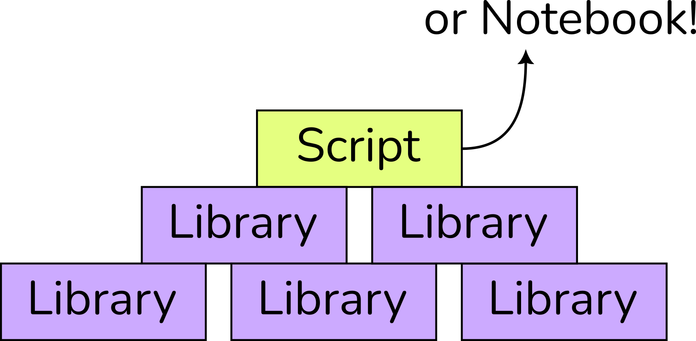

<!-- .slide: data-state="title" -->

# Distributing Software

===

<!-- .slide: data-state="standard" -->

## Why distribute?

1. For reproducibility/transparency of research
2. For developers that want to reuse parts of your software/methods
3. For users that want to use your software

note:
There are many potential reasons for distributing your software. In science, these three
scenarios are the most common. Note that users and developers can include yourself!

===

<!-- .slide: data-state="standard" -->

## Kinds of software

Script, program, notebook, package, library, image, container, it's confusing!

Let's clear that up first

note:
Software can seem very confusing, because there are many different terms that are used
to describe various kinds of software, and they're often used sloppily as well. So let's
start with explaining a bit how software is put together, and what all these terms mean.

===

<!-- .slide: data-state="standard" -->

### Functions (or Procedures)

- Ordered list of instructions
- Like a recipe
- Can refer to other recipes
- Closed box

<pre style="font-size: 70%; text-align: left">
def minmax(list_of_things):
    sorted_things = sorted(list_of_things)
    smallest = sorted_things[0]
    largest = sorted_things[-1]
    return smallest, largest
</pre>

note:
To start, let's simplify everything way down and look at a basic component of software,
the function. (There's more to it, but this is all we need here and gives a good idea.)
A function, or procedure which is really a better term but not what most people use
anymore, is a list of instructions, like a recipe.

To make lasagna, you use sheets of dough, Bechamel sauce, and tomato sauce, and stack
them up in alternating layers before cooking everything in the oven. Of course tomato
sauce does not grow on trees, so you'll need a sub-recipe to make that, and it's the
same with functions: they call other functions.

Like with cooking, where you might get some ready-made pasta or sauce, the functions
called from a function can be made by someone else. Your laptop has tens or hundreds of
thousands of functions in it to do everything it does.

===

<!-- .slide: data-state="standard" -->

### Scripts and Notebooks

- Single file with function(s)
- Sit at the top of a pyramid
- Use libraries
- Run interactively
- User handles errors

note:
A script is a small bit of software, usually a single file with one or a few functions
in it. A notebook is a script that is run in a special environment, like Jupyter, which
shows the script as a document with blocks of code and results (e.g. graphs) embedded in
it.

Scripts and notebooks are run interactively by a user, who can see the code and handles
any errors, if they occur. The functions called by the functions in a script are usually
not in the script itself, but come from libraries.

===

<!-- .slide: data-state="standard" -->

### Libraries

- Lower levels of the pyramid
- Ready-made functionality
- Have an interface
- Handle errors itself

note:
Libraries are collections of functions intended for use by others, either other
libraries, or scripts, or even people. They contain ready-made functionality organised
around a topic. For example there are plotting libraries that can make different kinds
of graphs, or libraries that can solve particular kinds of equations.

Libraries have an interface or API, which consists of functions that the user is
supposed to call. The library will probably have some internal functions as well.
Libraries need to handle any errors if they occur, either by working around the problem
or by reporting it to the user in a well-defined way.

Designing APIs and handling errors is hard, so making a good library is not so easy, but
libraries are very reusable.

===

<!-- .slide: data-state="standard" -->

### Programs

- At the top, or including all
- Bigger than a script
- Not meant for programming
- User interface

note:
Program is a very generic term. A script is a small program, and the borderline isn't
very clear. A program can do things on its own, so a library is not a program. Programs
often include all the libraries that they use, but you can also say that program X
depends on library Y. A program is not meant for programmers, but for end users, with
which it communicates through some kind of user interface, be it graphical or using text
or on the command line.

===

<!-- .slide: data-state="standard" -->

### Packages

- A file containing a collection of software
- Intended for distribution
- Usually holds a library or a program
- Has metadata
- Listed in a package index
- Installed using a package manager

note:
Packages are often used to distribute software. A package is an archive file (e.g. a
ZIP file) that contains software, usually a library or a program. There is also metadata
that describes, among other things, licenses and authors and other packages containing software that is
needed by this one.

Packages are usually uploaded to a package index, an online store of packages where
users can find them and download them, e.g. PyPI or CRAN. Finding, downloading and
installing is done using a tool called a package manager, like pip or conda.

Especially older programming languages may not have a standard package index or package
manager, e.g. C++ and Fortran.

===

<!-- .slide: data-state="standard" -->

### Images and containers

- A file containing a collection of software
- Everything, including the OS
- Cannot be combined
- Can be run like a program, as a container

note:
A virtual machine image or container image is a file containing a collection of
software, like a package. However, an image contains absolutely everything needed,
including (most of) the operating system. If you have an image, then you can run the
program inside it on your computer. This will create a kind of virtual computer inside
your computer (that's called a Virtual Machine or a Container) inside which the software
runs. Containers cannot be combined and you can't call them from a script, so they're
only useful for programs, not for libraries, and the user needs special software to be
able to run the program.

===

<!-- .slide: data-state="standard" -->

### Scenario 1: Review & reproduce

- You have a script
- The script uses some libraries
- You want others to see and run it

===

<!-- .slide: data-state="standard" -->

### Distributing scripts/notebooks

- Make script/notebook available for download
- Make environment file, e.g. requirements.txt, environment.yml
- User uses a package manager to create environment
- User runs the script/notebook
- Optional: use an image (mostly long-term archival)

note:
In this case, you have a script or a notebook, and also an environment (e.g. using Conda
or virtualenv) with the libraries you use installed in it. This environment is really
just a folder on your computer with the libraries in it, and some machinery that makes
it so that when the script calls a function that is in a library, the library will be
found and the function run.

So, you need to share your script or notebook of course, but the user will also need a
similar environment to run it, otherwise those library functions are missing. You can
(and should!) facilitate that by making an environment file that describes all the
packages containing the libraries that you're using. If you then make that available,
the user can create a similar environment on their computer and run your script.

Software that manages these environments, like Conda and pip/virtualenv, can make these
environment files for you, and also read one and create an environment by downloading
all the needed packages from the Internet, so this is not too difficult.

Another option is to use an image, but 1) they're very big, 2) they require special
software, and 3) they're much more work to create. They do have the advantage that they
work without an Internet, or in the future when all that old stuff is no longer online.

===

<!-- .slide: data-state="standard" -->

### Scenario 2: A reusable method

- You have created a new method
- Should be somewhat generic
- To be used by programmers
- Needs a library!

note:
Scientists sometimes develop new methods for calculating something, for example
acoustics in a room. They will likely have a script that calculates things for their
paper, and that script can be shared as in Scenario 1, but it would also be nice if
people could use their method for calculating acoustics in all sorts of scenarios, in
combination with other calculations.

In this case, what's really needed is a library. As mentioned before, making libraries
isn't that easy, so they may need some help from a Research Software Engineer to design
a good interface. Another option, and often a better one actually, is to contribute to
an existing widely used library. That will give your code more exposure, and may get you
some help from its maintainers as well, in the form of reviews.

===

<!-- .slide: data-state="standard" -->

### Distributing libraries

- Make a package containing the library
- Add metadata with dependencies
- Upload the package to a repository

note:
The best way to distribute a library is by making a package for it, if there is a
suitable packaging system available. Most modern programming languages have one, e.g.
PyPI and pip for Python, or CRAN and install.packages() for R, or Cargo for Rust.

So your steps here are to find the right packaging system based on the programming
language the library is written in, then creating a package for that system (there is
usually a manual/tutorial available), and uploading the package to the repository so
that users can use their package manager to install it. Make sure to list all the
dependencies in the metadata!

For languages like Fortran or C++ that don't have a standard package manager, you could
try Conda, or make packages for an operating system-specific packaging system like
APT/DPKG (Debian/Ubuntu Linux), DNF/RPM (Red Hat Linux), HomeBrew or macPorts (macOS) or
even EasyBuild, Spack or Nix (on High-Performance Computing)

===

<!-- .slide: data-state="standard" -->

### Scenario 3: A whole application

- Not so common in science
- You have created a program
- To be used by end users

note:
Scientists don't often make whole applications with user interfaces that anyone can just
pick up and use. That's a lot of work, and you don't get credit for it in science.
Nevertheless there are examples of this, e.g. MaxEnt in ecology, and it could happen. In
this case, what you have is a program.

===

<!-- .slide: data-state="standard" -->

### Distributing programs

- In an app store!
- As an installer?
- As a package?
- As an image?

note:
There are a few options for distributing a program. Packaging systems can be used,
especially if the program is intended for use by programmers, or by more knowledgeable
users. An App Store is basically a packaging system for applications, and that would be
a good option too if available.

Another option is to make an installer. That's a single file that is a working program,
like a package, but it is also itself a program that when run will install your program
onto the user's system. If you've installed software on Windows then you may have seen
one, although they've mostly been replaced by app stores and may cause the operating
system to warn about suspicious software.

Finally, you could make an image here, but as before, it would be very large, and it
would require special software on the user's computer, so in the here and now it's not a
good option. It would be more resistant to changes in the operating system that break
the program, because it includes the old version of the operating system. And then
again, running an old operating system is a security risk.

===

<!-- .slide: data-state="standard" -->

### Updating software

- Can't we just put it online and be done?
- For scripts, you probably can
- Libraries and programs need maintenance

note:
Scripts are built on top of libraries, which sit on top of an operating system, which
sits on top of hardware, and all that stuff is constantly changing. Furthermore, people change and expect to use software in different ways over
time, and that also needs to be taken into account.

For example, the LimePy library in the AMUSE astrophysics software uses a function in
the SciPy library that does not exist anymore. The old version of SciPy it was written
for was designed for an old version of Python, which is no longer supported and
shouldn't be used anymore, for security reasons. Also, a script using LimePy may use
other libraries that require a newer SciPy, and you can't install multiple versions of
the same thing at the same time, so you won't be able to run that script anymore.

Because of this, all software needs to be updated from time to time in order to continue
to work. This is tricky in science, which works in terms of projects that are finished
and then replaced by something else. For scripts, it's probably not so important because
people can still read the script to see what you did, and update it if they see the
need.

For libraries and programs, it's a different story, because those are used over a longer
period, and for libraries other things get built on top of them, and we'd like all that
to continue to work.

===

<!-- .slide: data-state="standard" -->

### Versioning

- Use [Semantic Versioning](semver.org) for libraries (X.Y.Z)
- Less important for applications

note:
For libraries, it's important that you communicate about changes with programmers using
your library. If the changes affect your interface, then they will have to modify their
software to work with your new version. This is sometimes necessary and sometimes a good
idea, as long as it doesn't happen too often. You do need to communicate it clearly
however.

A good way to do that is to use Semantic Versioning. This uses X.Y.Z versions, and from
version 1.0.0 promises that everything built on top of the library will continue to work
as long as the first number remains the same. The second number is changed to mark
adding new functions, and the third number is incremented if the new version only fixes
bugs.

===

### Summary

- Script/notebook: publish with environment
- Library: package and upload
- Program: app store, package, installer

