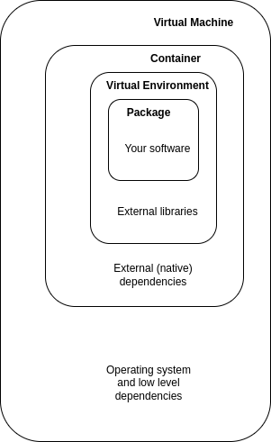

<!-- .slide: data-state="title" -->

# Distributing Software

===

<!-- .slide: data-state="standard" -->

## Why distribute?

- For your future self
- For others that might be interested
- For reproducibility 
- For reusability

note:
There are many reasons why you would want to distribute your software. 

===

<!-- .slide: data-state="standard" -->

## Why can't I just publish and be done?

- A piece of software never operates in isolation. 
- Depends on other software (third party packages, libraries)
- Depends on system software (operating system, drivers, firmware)
- Depends on hardware (your computer and the chips inside, display or printer)
- The world (hardware, software, people) around your software is constantly evolving

note:
Software by nature always depends on other software and hardware. 

===

<!-- .slide: data-state="standard" data-background-image="media/fire.png"-->

note: Sometimes you enter dependency hell

===

<!-- .slide: data-state="standard" -->

## What issues may arise?

- Many dependencies
- Long chains of dependencies
- Conflicting dependencies
- Circular dependencies
- Package manager dependencies
- Diamond dependency

... and all of these are changing.

===

<!-- .slide: data-state="standard" -->

## What solutions exist?

Isolation or specification

===

<!-- .slide: data-state="standard" -->

## Isolation

===

<!-- .slide: data-state="standard" -->

## Specification

Let the user (or some tool) solve the probem...

- requirements.txt
- environment.yml
- pyproject.toml
- package.json
etc...

note:
Specify the dependencies in a file and let the user build their own environment, container or vm.

===

## Considerations

- Large amount of isolation enhances reproducibility but decreases flexibility.
- Leaving it up to the user can be done for simple scripts (most research software)

===

## Rules of thumb   

- Simple scripts can use a simple dependency specification
- If other software might depend on this software, package it
- To archive a specific software version and its environment, you could use a container

