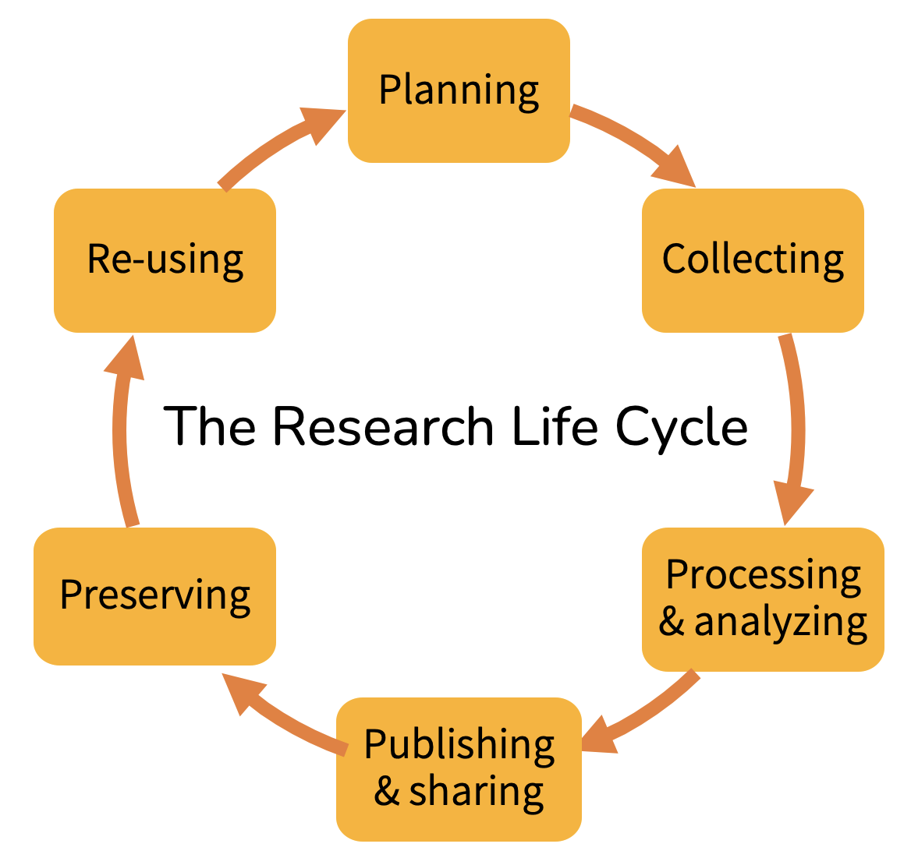

## Exercise: Where does software fit in the research life cycle?

Take a look at the research life cycle below.

### Pick a piece of software

Think of a piece of software you have heard about, used, contributed to or developed in a research context.

The following research software can also be used as examples:

- [ESMValTool](https://research-software-directory.org/software/esmvaltool)
- [LitStudy](https://research-software-directory.org/software/litstudy)
- [Haddock](https://research-software-directory.org/software/haddock3)
- [worcs](https://cjvanlissa.github.io/worcs/index.html)
- [democracy-topic-modelling](https://research-software-directory.org/software/democracy-topic-modelling)

### Answer the following questions 
Write a short paragraph (max. 100 words) per question:

- Would you consider this Research Software or Software used in Research? Explain why.
- Where does it fit in the research life cycle? Explain why.
