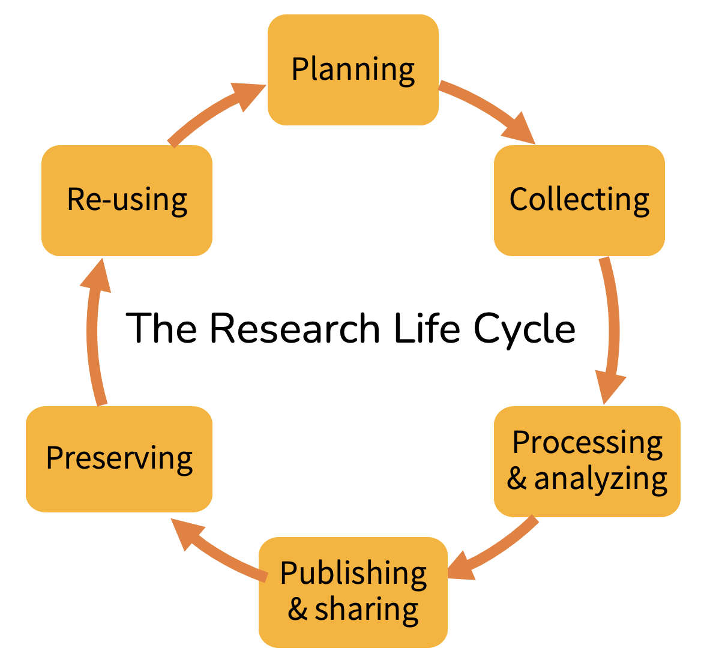
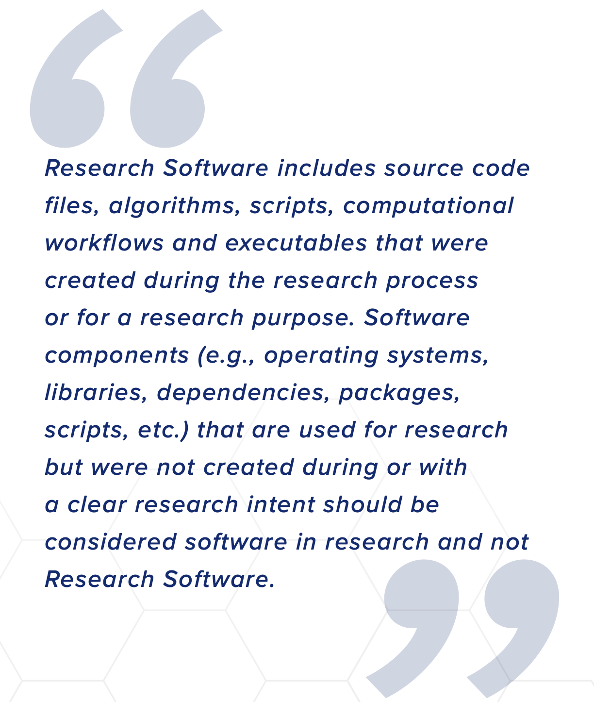
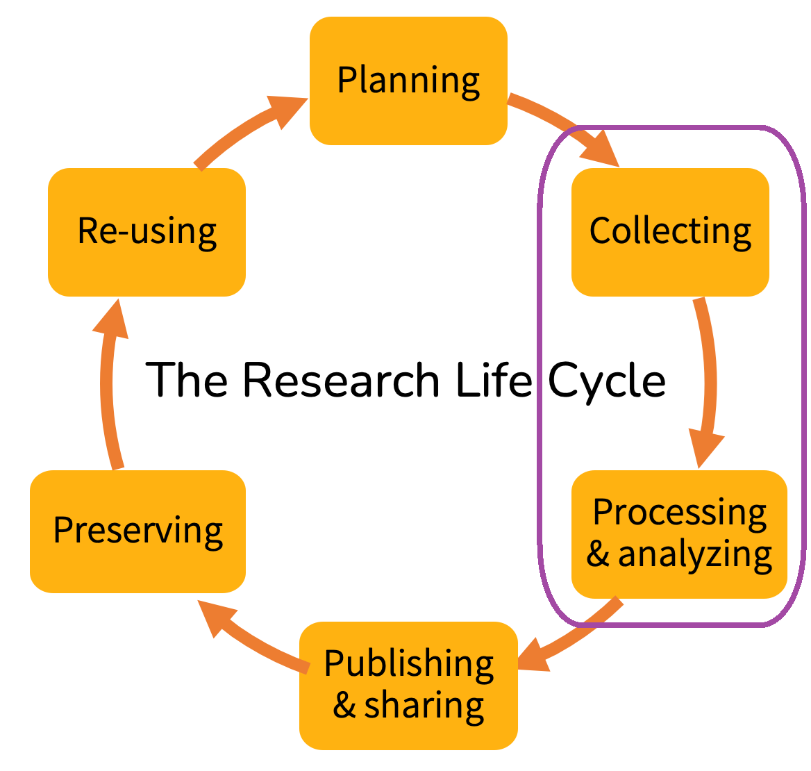

<!-- .slide: data-state="title" -->

# Research software

===

<!-- .slide: data-state="standard" -->

## *Ceci n'est pas une photo*

<small>[The Event Horizon Telescope Collaboration et al. 2019](https://doi.org/10.3847/2041-8213/ab0ec7) (CC BY 3.0)</small>

Note:

Software plays an important role in science. A first thought may be its role in data collection and analysis. Further, it may play a role in designing experiments, based on models generated. It may _be_ the experiment itself, simulate a research outcome based on data or ideas entered; it may also be the "brain" behind controlling crucial instrumentation.

What scientific software can you think of?

What role does it play?

An example here: the Event Horizon Telescope, which took a "picture" of a black hole.
The "telescope" is not a single tool, but complex: a "planet-scale array of eight ground-based radio telescopes" (wikipedia).
The separate telescopes collect data that is synchronized with atomic clocks, and the data is combined at highly specialised supercomputers.
The data can be converted into an image using custom software.

===

<!-- .slide: data-state="standard" -->

## The research lifecycle

In which stages is software used?

Note:

Software is used all across the research life cycle.

===

<!-- .slide: data-state="standard" -->

### What is Research Software?

<small>definition of Research Software from the FAIR4RS working group</small>

Note:

A definition of research software, from the FAIR4RS working group.
It is important that not all software that is used in research is research software.
For example, a text editor that is used to write a paper is not research software.
Nor is powerpoint, a web browser, or the software used to guide the telescope.
Even tools like R or Python are not necessarily research software.
The code written in R or Python for an analysis would be research software, however.
Just like a custom-made Excel macro that is used to analyse data.
Or a custom-made web application that is used to collect data.

==

<!-- .slide: data-state="standard" -->

## The research lifecycle

In which stages is ***Research Software*** used?

Note:

Research Software is *mainly* used in "Collecting" and "Processing & analyzing" steps. 
However, non-research software can also be used in these steps, and research software can also be used in other steps.

==

<!-- .slide: data-state="standard" -->

## The research lifecycle

In which stages is ***Research Software*** used?

Note:

Research Software is *mainly* used in "Collecting" and "Processing & analyzing" steps. 
However, non-research software can also be used in these steps, and research software can also be used in other steps.

===

<!-- .slide: data-state="standard" -->

## Why the distinction?

Defining Research Software...

- Acknowledges its importance during research
- Designates it as research output
- Enables proper attribution
- Facilitates findability and reusability

Note:

By defining research software:

- we can more easily justify and emphasize how essential it is while doing research
- we can emphasize that creating (good) research software is an essential part of research and that the product is a true "deliverable" e.g. in grant applications
- we give the opportunity for the developers to gain (citable) recognition for their work
- by tagging software as "research software", we make it more (computer) findable, and therefor more easily reused

===

<!-- .slide: data-state="standard" -->

## Take home messages

- Software is an important part of research
- Not all software used in research is Research Software
- Defining "Research Software" provides recognzition in the research community

===

<!-- .slide: data-state="keepintouch" -->

www.esciencecenter.nl

info@esciencecenter.nl

020 - 460 47 70
