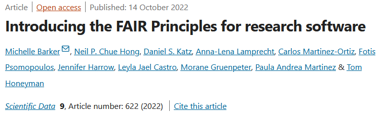

<!-- .slide: data-state="title" -->

# What is software?

===

<!-- .slide: data-state="standard center" -->

## Some history

<small>Photo by <a href="https://www.wikidata.org/wiki/Q106975068">Stefan Kuhn</a> on <a href="https://commons.wikimedia.org/wiki/File:Lochkarte_Tanzorgel.jpg">Wikimedia</a>
</small>

Note:
Who knows what this is?

See next slide for explanation.

==

<!-- .slide: data-state="standard center" -->

## Some history

<small>Photo by <a href="https://www.wikidata.org/wiki/Q106975068">Stefan Kuhn</a> on <a href="https://commons.wikimedia.org/wiki/File:Lochkarte_Tanzorgel.jpg">Wikimedia</a>
</small>

Note:
A street organ's machinery is instructed by long "books" of cardboard with holes punched in it. Each hole triggers one specific note and/or instrument to play in the organ. In this way the organ can be "programmed" and the punch book can be considered the software of the organ.

==

<!-- .slide: data-state="standard center" -->

## Some history

<iframe width="560" height="315" src="https://www.youtube.com/embed/wbLuMd5zYww?si=a_eppMknE5TOFPCY&amp;start=277" title="YouTube video player" frameborder="0" allow="accelerometer; autoplay; clipboard-write; encrypted-media; gyroscope; picture-in-picture; web-share" referrerpolicy="strict-origin-when-cross-origin" allowfullscreen></iframe>

<small><a href="https://youtu.be/wbLuMd5zYww?si=3o0zptLY4c3i1ppk&t=275">https://youtu.be/wbLuMd5zYww?si=3o0zptLY4c3i1ppk&t=275</a>
</small>

<!-- Speaker notes -->
Note:
A long book of cardboard with holes punched in it is used to give the street organ instructions on which mechanical instruments should play what note at which time. 

===

<!-- .slide: data-state="standard center" -->

## Some more history

<small>Photo by Rainer Gerhards on <a href="https://commons.wikimedia.org/wiki/File:Punch-card-cobol.jpg">Wikimedia</a>
</small>

<!-- Speaker notes -->
Note:
Who knows what this is? Looks similar to the previous thing, right? This is software.

==

<!-- .slide: data-state="standard center" -->

## Some more history

<iframe width="560" height="315" src="https://www.youtube.com/embed/kaQmAybWn-w?si=OxhzN1myjx6d4vZt&amp;start=540" title="YouTube video player" frameborder="0" allow="accelerometer; autoplay; clipboard-write; encrypted-media; gyroscope; picture-in-picture; web-share" referrerpolicy="strict-origin-when-cross-origin" allowfullscreen></iframe>
<small><a href="https://youtu.be/kaQmAybWn-w?si=zRmBx4Df68gWuw3e&t=540">https://youtu.be/kaQmAybWn-w?si=zRmBx4Df68gWuw3e&t=540</a>
</small>

<!-- Speaker notes -->
Note:
This software was written using special typewriters that would punch holes in cardboard cards. It would encode instructions to the computer hardware, in this case the hardware is a UNIVAC 90/30 (1974). One punchcard from the old UNIVAC 90/30 system would hold a single line of code. A program usually consisted of a whole stack of these cards.

==

<!-- .slide: data-state="standard center" -->

## Some more history

<iframe width="560" height="315" src="https://www.youtube.com/embed/SYpPPIsxq64?si=ixgCa3fUJY5ccAkE&amp;start=793" title="YouTube video player" frameborder="0" allow="accelerometer; autoplay; clipboard-write; encrypted-media; gyroscope; picture-in-picture; web-share" referrerpolicy="strict-origin-when-cross-origin" allowfullscreen></iframe>
<small><a href="https://youtu.be/SYpPPIsxq64?si=m__szsXBDI6SP5kx&t=793">https://youtu.be/SYpPPIsxq64?si=m__szsXBDI6SP5kx&t=793</a>
</small>

<!-- Speaker notes -->
Note:
These punchcards would be loaded into the computer to instruct which parts of the hardware should act in which way and when. In this video, you see an even older computer, the Harwell Dekatron or W.I.T.C.H. (1952), which reads its software from perforated paper tape. 

===

<!-- .slide: data-state="standard center" -->

## Software today

<small>Photo by <a href="https://unsplash.com/@thisisengineering">ThisisEngineering</a> on <a href="https://unsplash.com/photos/black-flat-screen-computer-monitor-hoivM01c-vg?utm_content=creditShareLink&utm_medium=referral&utm_source=unsplash">Unsplash</a></small>

<!-- Speaker notes -->
Note:
Q: In what way is modern software different from historic punch-card "software"

Some possible answers:
These days, software usually gets written using a computer, in a text editor program, so the act of writing software requires software itself. The software is stored in memory and on a hard disk rather than on cardboard (remember, one card per line...). Modern software often builds on other software, or used specific parts of other software packages, rather than re-defining the wheel.

However, it ultimately still basically does the same: Software is a set of instructions that tells hardware what to do.

==

<!-- .slide: data-state="standard center" -->

## Complexity of modern software

<small>Screenshot of source code for <a href="https://github.com/DeepRank/deeprank2">DeepRank2</a></small>

<!-- Speaker notes -->
Note:
In this image, we can get a glimpse of the complexity of modern software. We can see that software has a certain structure (indicated by differently colored text), is often composed of many lines of code (right side of image shows the entire length of the code), and is split over multiple intercommunicating files (left).

===

<!-- .slide: data-state="standard center" -->

## Software is a form of data

<small>Definition by <a href="https://www.merriam-webster.com/dictionary/data/">Merriam Webster English Dictionary</a></small>

==

<!-- .slide: data-state="standard" -->

## Software is data

Software can be ...

- stored as bits
- read, loaded, and processed
- input and/or output
- can be assigned a DOI, licence, etc

<!-- Speaker notes -->
Note:
- Software is stored as bits and read from disk, loaded into memory, and processed similar to other types of data. 
- Software can be input, and software can be output. In fact, one of the major breakthroughs in computer science was when people realized that the instructions of the machine could be handled and stored the same as the data that it operated on. 

==

<!-- .slide: data-state="standard" -->

## BUT

==

<!-- .slide: data-state="standard" -->

## Software is a special type of data

Software is...

- **complex**: it is creatively generated, interconnected, and multi-layered
- **interdependent**: it builds upon and therefore depends on other software (and data)
- **executable**: it needs to be run to have a value (e.g. to process data)
- **dynamic**: it can (and will) break soon and therefore needs to be regularly updated 

<!-- Speaker notes -->
Note:
While technically, software is a special kind of data (in that it is representation of information in a digital state), they are in essence quite different.

- Complexity; it is not a single file, but a collection of files that are interconnected and multi-layered, and do not necessarily stand on their own. Software is also the result of a creative process that provides a tool to do something, and not the result of a measurement or observation.
- Interdependence; software is often built using other software, and rarely built completely from scratch. This makes it dependent on other existing applications, which themselves may also change over time. In the context of research software it also often depends on the data, data formats, data standards, metadata, etc, which also change when new equipment becomes available.
- Executability; software is in its dryest form a set of instructions that can be an archive of a procedure. However, the main goal of software is that these instructions can be executed. While most forms of data can stand on their own (e.g. I can look at the list of ages of all the people in a room and make conclusions about average age, etc.), software cannot be directly interpreted (only in the context of what it does).
- Dynamic vs static; its interdependence and context-dependency drives software to require maintenance to retain its value, and this maintenance is not straightforward. Versioning of software is very common, while data is often static (though versions may happen).

==

<!-- .slide: data-state="standard" -->

## Software requires dedicated maintenance

- Software needs to be actively maintained to remain useable.
  - This is contrary to 'regular' data, which is expected to remain static forever.
- Maintenance is often lacking in academic contexts
  - lack of funding
  - lack of incentives/rewards
  - lack of understanding and expertise (maintenance is a different from creation)
  - individualistic work with fast turnover

<!-- Speaker notes -->
Note:
'Regular' data can sometimes be versioned, but this is more the exception than the rule.

Regarding the reasons for lack of maintenance:
- funding opportunities for this do exist, but are rare and usually only for large projects
- while you can sometimes publish a major update to a software package, this is also rare, and will even more rarely result in a high-impact/highly cited paper. it is also not highly appreciated e.g. on a CV.
- while academics can often create software that "does the job" well, a different skillset is required to maintain the software (or write it in a way to facilitate maintenance)
- academics often work on projects by themselves and then move on soon after their papers are published, leaving a knowledge gap for others to maintain the software

===

<!-- .slide: data-state="standard" -->

## Software vs data management

<ul style="margin-bottom: 20px;">
  <li>Software is a <strong>living thing</strong></li>
  <li>Good data management will not ensure good software management</li>
  <li>While some FAIR data management practices apply directly to software, others do not apply as easily
    <ul>
      <li>see <a href="https://www.nature.com/articles/s41597-022-01710-x">FAIR software paper</a></li>
    </ul>
  </li>
  <li>There is a thriving open-software community that has generated many tools and standards to facilitate good practices</li>
</ul>

Note:
The different nature of software also provides opportunities but also requires extra thought on its management.
Software is a living thing, and therefore it is easier to adopt good practices early on.
Crucially, there is a community driven openness in software that long predates the open science movement.
This is not to say that software is inherently open, but that there is a broad open culture, which also comes with existing tools and pathways to facilitate openness and transparency.
Consider GitHub (and other code hosting platforms), which are designed for this purpose.
Consider also version control software, a good software development practice that builds in provenance.

===

<!-- .slide: data-state="standard" -->

## Take home messages

- Software are the instructions that tell the hardware (computer) what to do
- Software is a 'living thing'
- We need extra and different techniques for good software management

===

<!-- .slide: data-state="keepintouch" -->

www.esciencecenter.nl

info@esciencecenter.nl

020 - 460 47 70
