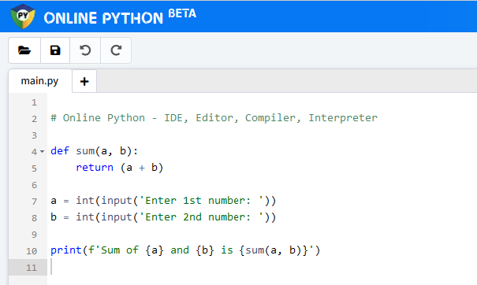

## Writing software with Python (10 minutes)

<small>https://www.online-python.com/</small>

### If you have never written software before:

- Visit https://www.online-python.com/
  - it will show you as an example the code for a function that adds items together.
- Play around with the code a bit, e.g.
  - Try using words instead of numbers as inputs. What happens and why?
  - Add a function that subtracts items rather than adding them. What happens now if you use words instead of numbers, and why?
  - What else can you do?

### If you have experience in writing software:

- Buddy up with someone from the above group.
- Use the 4-eye principle (pair programming), to watch what they are doing and help them figure out what is going on and why.
- Try to be conscious in explaining what is important and what your buddy needs to know without overcomplicating matters or taking over the keyboard.
