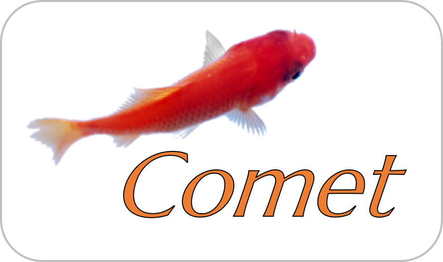
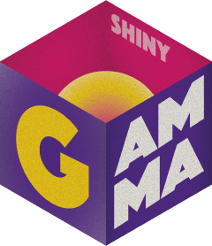

## **Exercise:** Mapping the FAIR principles

Choose one of the three examples of software below: [Comet](http://localhost:3000/research-software-support/modules/softwarelandscape/exercise2#software-1-comet), [PureGoMe](http://localhost:3000/research-software-support/modules/softwarelandscape/exercise2#software-2-puregome), or [gammaShiny](http://localhost:3000/research-software-support/modules/softwarelandscape/exercise2#software-3-gammashiny). They have been described with statements that can be mapped to the FAIR4RS Principles. With each statement in the software description, identify the principle(s) it maps to, and the (sub)facet(s) of the principle(s) it addresses. A single statement may map to multiple (sub)facets.

|**The FAIR4RS Principles** <small> (https://zenodo.org/records/6623556) </small>|
|:------|
| **F: Software, and its associated metadata, is easy for both humans and machines to find.** |
| F1. Software is assigned a globally unique and persistent identifier.   --- F1.1. Components of the software representing levels of granularity are assigned distinct identifiers.   --- F1.2. Different versions of the software are assigned distinct identifiers.   F2. Software is described with rich metadata.   F3. Metadata clearly and explicitly include the identifier of the software they describe.   F4. Metadata are FAIR, searchable and indexable. |
| **A: Software, and its metadata, is retrievable via standardized protocols.** | 
| A1. Software is retrievable by its identifier using a standardized communications protocol.   --- A1.1. The protocol is open, free, and universally implementable.   --- A1.2. The protocol allows for an authentication and authorization procedure, where necessary.   A2. Metadata are accessible, even when the software is no longer available. |
| **I: Software interoperates with other software by exchanging data and/or metadata, and/orthrough interaction via  application programming interfaces (APIs), described throughstandards.** |
| I1. Software reads, writes and exchanges data in a way that meets domain-relevant community standards.   I2. Software includes qualified references to other objects. |
| **R: Software is both usable (can be executed) and reusable (can be understood, modified, builtupon, or incorporated into other software).** |
| R1. Software is described with a plurality of accurate and relevant attributes.   --- R1.1. Software is given a clear and accessible license.   --- R1.2. Software is associated with detailed provenance.   R2. Software includes qualified references to other software.   R3. Software meets domain-relevant community standards.|

### Software 1: Comet

[Comet](https://doi.org/10.1002/pmic.201200439) is a command-line tool and desktop application for tandem mass spectrometry sequence database search6.

- Comet is licensed under the Apache 2.0 open source licence.
- Comet is registered in the bio.tools catalogue of bioinformatics tools, where it has a globally unique and persistent identifier, and rich metadata that includes the identifier and is searchable and indexable.
- The metadata in bio.tools is independent from the Comet repository, and will stay accessible should the software itself become inaccessible.
- The publicly accessible project repository on GitHub includes detailed information about the development of Comet.
- The code includes dependencies to external software packages, such as Thermo Scientific’s MSFileReader library.
- Comet can be downloaded via the browser following the links provided in the metadata using https.
- Comet uses standard data types from the proteomics domain for its input and output data that are documented in the metadata as functional annotations.

### Software 2: PureGoMe

[PureGoMe](https://doi.org/10.5281/zenodo.4337242) is a project aimed at understanding Dutch public sentiment during the COVID-19 outbreak period by analysing real-time Twitter data. It provides a collection of Python scripts and Jupyter notebooks for this purpose.

- PureGoMe can be downloaded from the project repository, while metadata is accessible independently from the registry.
- PuReGoMe's GitHub repository has detailed records of the development history.
- The code includes dependencies to other software, such as various Python libraries.
- PuReGoMe has a (versioned) DOI from Zenodo.
- PuReGoMe uses the Apache 2.0 open source licence.
- PuReGoMe uses standard file formats (e.g., CSV files) for data exchange.
- PuReGoMe refers to other objects such as websites.
- PureGoMe is registered in the Research Software Directory that captures the most relevant metadata, including the identifier, in searchable and indexable form.

### Software 3: gammaShiny

[gammaShiny](https://doi.org/10.5281/zenodo.4139005) is an application that provides enhanced graphical user interfaces for the R gamma package8. It is used to process in-situ gamma-ray spectrometry measurements for luminescence dating.

- gammaShiny has been deposited in the HAL French national archive and it has a persistent globally unique identifier, with the HAL identifier of the metadata record and a SWHID, identifying specifically the software artefact on the Software Heritage universal software source code archive.
- Thanks to the HAL platform, where a licence is mandatory, gammaShiny is under a GNU General Public Licence v3.0.
- The archived versions of gammaShiny’s source code in Software Heritage include a codemeta.json file, identifiable with a SWHID, where other metadata is available including dependencies named in CodeMeta ("softwareRequirements").

## Do you agree?

The examples were taken from [this paper](https://doi.org/10.1038/s41597-022-01710-x).
In the Results section of the paper you will find the authors' analysis of the software, which contains the statements above, mapped to the FAIR4RS Principles.

Do you agree with their assessment?
