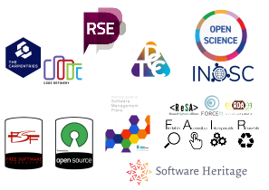
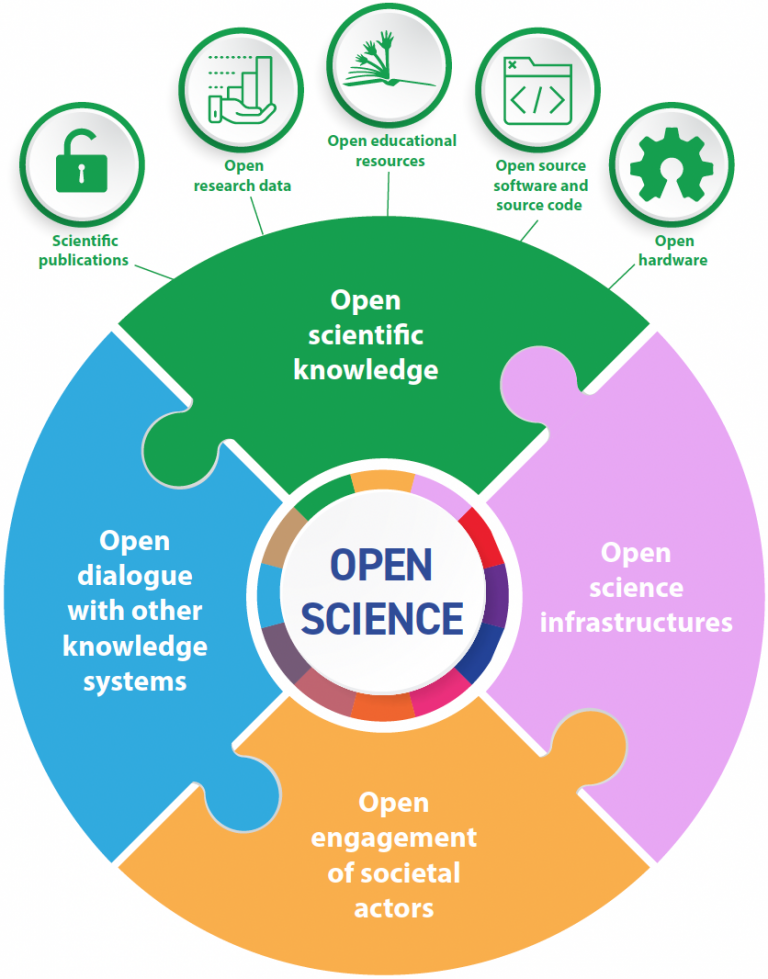
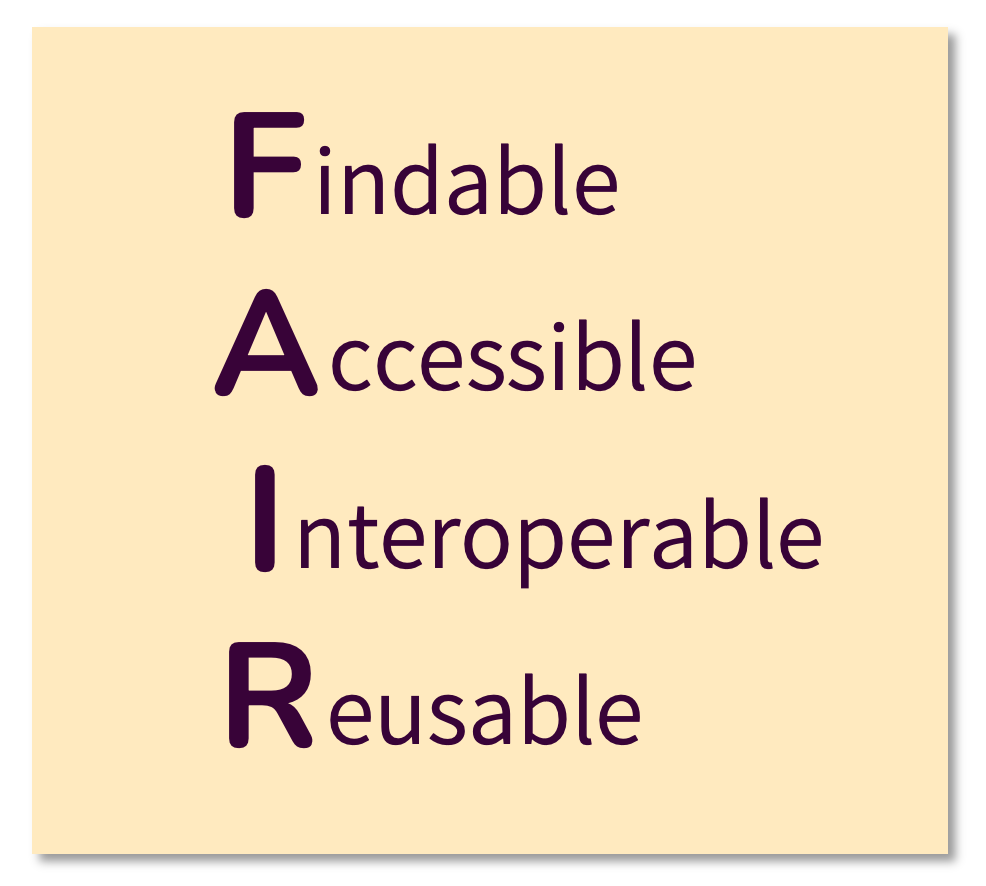
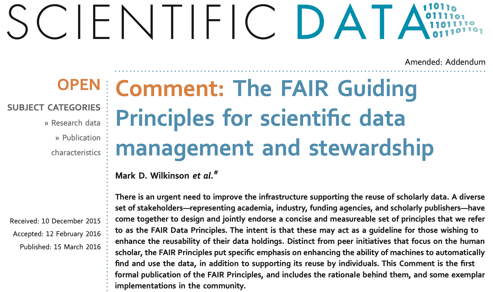
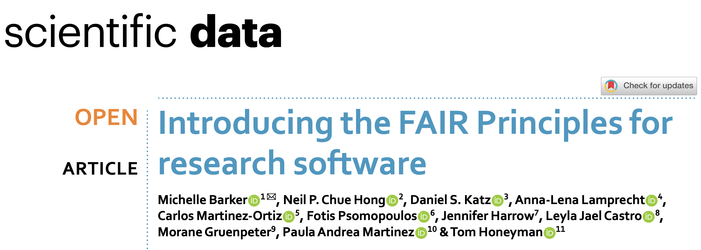
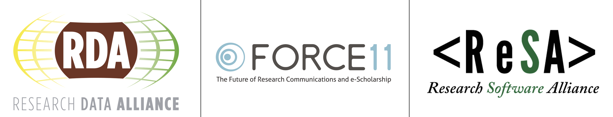
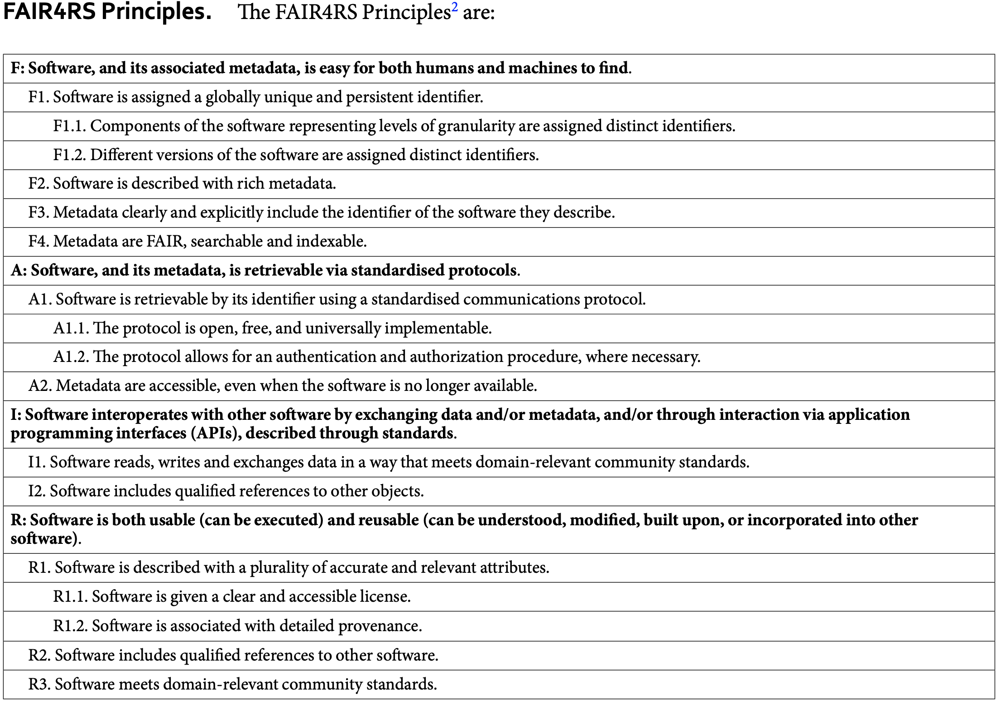
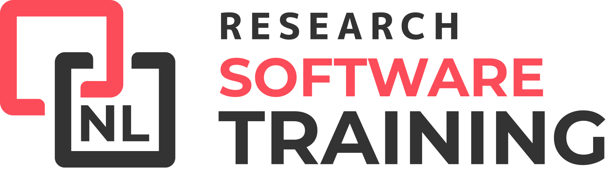

<!-- .slide: data-state="title" -->

# The Research Software Landscape

===

<!-- .slide: data-state="standard" -->
### Why do researchers write software?
**Trends in research**
- Research depends on building on previous research
- Research increasingly depends on software/code
- Researchers want/need control over their methods

==

<!-- .slide: data-state="standard center" -->
### Why do researchers write software?
**Existing software is not ... enough**

- Existing software is not *bleeding edge*
- Existing software is often closed source
- Using closed-source software decreases flexibility
- Closed-source software hides the research method

==

<!-- .slide: data-state="standard center" -->
### Problems in research software

- **So** researchers often write software themselves 
- **But** researchers are not trained as software engineers
- **And** software is not (yet) regarded as valuable research output

Note:
First is a true statement. 
Second statement describes a problem with code quality, sustainability and reproducibility
Third statement uncovers a problem with attribution, funding, etc.

==

<!-- .slide: data-state="standard center" -->
### This results in problems with:

- Software quality and sustainability
- Reproducibility of research
- Attribution for researchers writing code
- Funding for research software

===

<!-- .slide: data-state="standard black-overlay" id="landscape" data-background-image="media/landscape.jpg" -->
## Current Landscape

note:
Many initiatives have been started to solve the problems that were mentioned. 

- Research Software Engineers communities and networks
- Open Science 
- FAIR for Research Software 
  - [ReSA (Research Software Alliance)](https://www.researchsoft.org/)
  - RDA (Research Data Alliance)
  - FORCE11 (SCholarly Communication)

- FOSS (Free and Open Source Software)(https://freeopensourcesoftware.org/)
- Software Heritage (https://www.softwareheritage.org/)
- Research Software training
  - Carpentries 
  - Code Refinery
  - The Turing Way

- Software Management Plan working group (NWO, eScience Center)

===

<!-- .slide: data-state="standard center" id="rse-world" -->
## The worldwide RSE movement

<small>[The national associations around the world as at 2023. (image courtesy of Ian Cosden, US RSE Association)](https://www.fz-juelich.de/en/rse/about/rse-worldwide)</small>

Note:
RSE stands for Research Software Engineer. This is a person that writes or contributes to Research Software. 
The community of RSE's is growing and many strive for recognition of the RSE trade and respecting software as scientific output. 

The eScience Center published their role description of RSEs in general and a job profile specific to RSEs at the eScience Center. 

===

<!-- .slide: data-state="standard center" -->
## Open Science

<small>[UNESCO Recommendation on Open Science, 2021](https://creativecommons.org/2021/12/02/unesco-recommendation-on-open-science-ratified/) (CC BY IGO 3.0)</small>

note:
Open Science encompasses many aspects of science.
It is a movement that aims to make science — which includes software — more open, transparent, and accessible.
This is supported by many organisations, including UNESCO. The Netherlands recently started its own program dedicated to open science called "Regie Orgaan Open Science NL"

===

<!-- .slide: data-state="standard center" -->
## The FAIR principles

note:
The FAIR principles standardize values that help openness, transparency, and accessibility.

==

<!-- .slide: data-state="standard center" -->

## FAIR (for data)

note:
FAIR principles were originally also with other digital objects in mind than just plain research data, though the actual description was very data-specific.
This has been extended meanwhile.

==

<!-- .slide: data-state="standard center" -->

## FAIR (for software)

note:
In 2022, the results of extensive community consultation were published in the FAIR for Research Software paper.
The working group behind this was a collaboration between the Research Software Alliance, the Research Data Alliance, and FORCE11.

==

<!-- .slide: data-state="standard" -->

## FAIR (for software)

Note:
These are the interpretations given to the FAIR principles for software by the working group.
In many cases these are rephrased to better fit software, but in some cases they are also extended.

===

<!-- .slide: data-state="standard center" -->

## Training

https://researchsoftwaretraining.nl/

Note:
The dutch research software training network brings together all initiatives on training for research software and related topics. You may know of the Carpentries, and you might be following these materials because you know of the Netherlands eScience Center's training program, but there is much more!

===

<!-- .slide: data-state="standard center" -->
## Challenges of the Research Software Landscape
- Still developing
- As a result:
  - Lots of uncertainty
  - Few policies and job positions
  - Researchers might not be aware of the issue
- How can we activate the scientific community?

Note:
- Discuss diversity of research support and the current state of the landscape (still developing, lots of uncertainty, non-existence of policies and actual positions)
- Discuss reason why this is important and it should be on the agenda
- Discuss that they might not get any questions about this, because researchers are not aware. They don't know they should ask, or what to ask. This might change once NWO implements the software management plans as requirement for grant applications.

==

<!-- .slide: data-state="standard center" -->
## Practical implications for your work

- Educate yourself and your surroundings
- Familiarize yourself with your institute's software
- Reach out to researchers (in a friendly manner) if they do not come to you
- Inquire about software policies with management
- Be aware that researchers might not be too willing

===

<!-- .slide: data-state="standard" -->

## Take home messages

- Software is an important part of research
- Some problems arise due to the combination of:
  - the role of software in research
  - the nature of software
  - how software is developed
- Many initiatives have started in the last decade to tackle these issues
- The landscape is still under heavy development

===

<!-- .slide: data-state="keepintouch" -->

www.esciencecenter.nl

info@esciencecenter.nl

020 - 460 47 70
