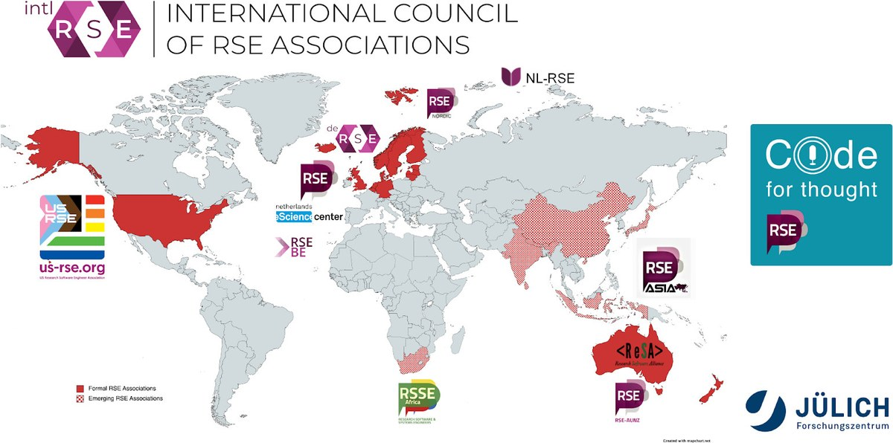

<!-- .slide: data-state="title blue_overlay yellow_flag yellow_strip purple_half_circle_bottom purple_blob right_e_top" -->

# The Research Software Landscape

===

<!-- .slide: data-state="standard" -->
### Why do researchers write software?
**Trends in research**
- Research depends on building on previous research
- Research increasingly depends on software/code
- Researchers want/need control over their methods

==

<!-- .slide: data-state="standard center" -->
### Why do researchers write software?
**Existing software is not ... enough**

- Existing software is not *bleeding edge*
- Existing software is often closed source
- Using closed-source software decreases flexibility
- Closed-source software hides the research method

Note:
Some examples of what the pitfalls or practical implications of using closed-source software are:
- It can be a barrier to reproducibility if a product needs to be purchased.
- Research methods could be obfuscated.
- Some behavior might be undocumented. This can be the case for open-source software as well, but there you can dig into it and verify.

==

<!-- .slide: data-state="standard center" -->
### Problems in research software

- **So** researchers often write software themselves
- **But** researchers are not trained as software engineers
- **And** software is not (yet) regarded as valuable research output

Note:
First is a true statement.
Second statement describes a problem with code quality, sustainability and reproducibility
Third statement uncovers a problem with attribution, funding, etc.

==

<!-- .slide: data-state="standard center" -->
### This results in problems with:

- Software quality and sustainability
- Reproducibility of research
- Attribution for researchers writing code
- Funding for research software

===

<!-- .slide: data-state="standard black-overlay" id="landscape" data-background-image="media/landscape.jpg" -->
## Current Landscape

note:
Many initiatives have been started to solve the problems that were mentioned.

- Research Software Engineers communities and networks
- Open Science
- FAIR for Research Software
  - [ReSA (Research Software Alliance)](https://www.researchsoft.org/)
  - RDA (Research Data Alliance)
  - FORCE11 (Scholarly Communication)

- FOSS (Free and Open Source Software)(https://freeopensourcesoftware.org/)
- Software Heritage (https://www.softwareheritage.org/)
- Research Software training
  - Carpentries
  - Code Refinery
  - The Turing Way

- Software Management Plan working group (NWO, eScience Center)

===

<!-- .slide: data-state="standard center" id="rse-world" -->
## The worldwide RSE movement

The national associations around the world as of 2024 (Credit: Daniel S. Katz [doi.org/10.5281/zenodo.7295422](https://doi.org/10.5281/zenodo.7295422))

Note:
RSE stands for Research Software Engineer. This is a person that writes or contributes to Research Software.

The community of RSE's is growing and many strive for recognition of the RSE trade and respecting software as scientific output.

The eScience Center published their role description of RSEs in general and a job profile specific to RSEs at the eScience Center.

===

<!-- .slide: data-state="standard center" -->
## Open Science

<small>[UNESCO Recommendation on Open Science, 2021](https://creativecommons.org/2021/12/02/unesco-recommendation-on-open-science-ratified/) (CC BY IGO 3.0)</small>

note:
Open Science encompasses many aspects of science.
It is a movement that aims to make science — which includes software — more open, transparent, and accessible.
This is supported by many organisations, including UNESCO. The Netherlands recently started its own program dedicated to open science called "Regie Orgaan Open Science NL"

===

<!-- .slide: data-state="standard" -->
### What communities to connect to?
**Overwhelmed?**
- It might be hard to distinguish what initiatives try to tackle which problems
- Some of the communities might be overlapping in people and goals
- What communities might benefit the researchers of your institute?
- What communities would you recomment researchers to connect with?

Let's do an exercise to explore these initiatives a bit better.

Note: problems mentioned earlier in this slide deck include:
- Software quality and sustainability
- Reproducibility of research
- Attribution for researchers writing code
- Funding for research software

===

<!-- .slide: data-state="standard center" -->
## The FAIR principles

note:
The FAIR principles standardize values that help openness, transparency, and accessibility.

==

<!-- .slide: data-state="standard center" -->

## FAIR (for data)

note:
FAIR principles were originally also with other digital objects in mind than just plain research data, though the actual description was very data-specific.
This has been extended meanwhile.

==

<!-- .slide: data-state="standard center" -->

## FAIR (for software)

note:
In 2022, the results of extensive community consultation were published in the FAIR for Research Software paper.
The working group behind this was a collaboration between the Research Software Alliance, the Research Data Alliance, and FORCE11.

==

<!-- .slide: data-state="standard" -->

## FAIR (for software)

<table style="text-align: left; font-size: small;">
<tr><th style="padding: 0.5em 1em;"><b>The FAIR4RS Principles</b> (<a href="https://zenodo.org/records/6623556">zenodo.org/records/6623556</a>)</th></tr>
<tr><td style="padding: 0.5em 1em;"><b>F: Software, and its associated metadata, is easy for both humans and machines to find.</b></td></tr>
<tr><td style="padding: 0.5em 1em;">F1. Software is assigned a globally unique and persistent identifier.   — F1.1. Components of the software representing levels of granularity are assigned distinct identifiers.   — F1.2. Different versions of the software are assigned distinct identifiers.   F2. Software is described with rich metadata.   F3. Metadata clearly and explicitly include the identifier of the software they describe.   F4. Metadata are FAIR, searchable and indexable.</td></tr>
<tr><td style="padding: 0.5em 1em;"><b>A: Software, and its metadata, is retrievable via standardized protocols.</b></td></tr>
<tr><td style="padding: 0.5em 1em;">A1. Software is retrievable by its identifier using a standardized communications protocol.   — A1.1. The protocol is open, free, and universally implementable.   — A1.2. The protocol allows for an authentication and authorization procedure, where necessary.   A2. Metadata are accessible, even when the software is no longer available.</td></tr>
<tr><td style="padding: 0.5em 1em;"><b>I: Software interoperates with other software by exchanging data and/or metadata, and/or through interaction via  application programming interfaces (APIs), described through standards.</b></td></tr>
<tr><td style="padding: 0.5em 1em;">I1. Software reads, writes and exchanges data in a way that meets domain-relevant community standards.   I2. Software includes qualified references to other objects.</td></tr>
<tr><td style="padding: 0.5em 1em;"><b>R: Software is both usable (can be executed) and reusable (can be understood, modified, built upon, or incorporated into other software).</b></td></tr>
<tr><td style="padding: 0.5em 1em;">R1. Software is described with a plurality of accurate and relevant attributes.   — R1.1. Software is given a clear and accessible license.   — R1.2. Software is associated with detailed provenance.   R2. Software includes qualified references to other software.   R3. Software meets domain-relevant community standards.</td></tr>
</table>

Note:
These are the interpretations given to the FAIR principles for software by the working group.
In many cases these are rephrased to better fit software, but in some cases they are also extended.

===

<!-- .slide: data-state="standard center" -->

## Training

https://researchsoftwaretraining.nl/

Note:
The Dutch research software training network brings together all initiatives on training for research software and related topics. You may know of the Carpentries, and you might be following these materials because you know of the Netherlands eScience Center's training program, but there is much more!

Worth checking what local training about good practices for research software development is offered at your local institute, so you can refer researchers to those!

===

<!-- .slide: data-state="standard center" -->
## Challenges of the Research Software Landscape
- Still developing
- As a result:
  - Lots of uncertainty
  - Few policies and job positions
  - Researchers might not be aware of the issue
- How can we activate the scientific community?

Note:
- Discuss diversity of research support and the current state of the landscape (still developing, lots of uncertainty, non-existence of policies and actual positions)
- Discuss reason why this is important and it should be on the agenda
- Discuss that they might not get any questions about this, because researchers are not aware. They don't know they should ask, or what to ask. This might change once NWO implements the software management plans as requirement for grant applications.

==

<!-- .slide: data-state="standard center" -->
## Practical implications for your work

- Educate yourself and your surroundings
- Familiarize yourself with your institute's software
- Reach out to researchers (in a friendly manner) if they do not come to you
- Inquire about software policies with management
- Be aware that researchers might not be too willing

===

<!-- .slide: data-state="standard" -->

## Take home messages

- Software is an important part of research
- Some problems arise due to the combination of:
  - the role of software in research
  - the nature of software
  - how software is developed
- Many initiatives have started in the last decade to tackle these issues
- The landscape is still under heavy development

===

<!-- .slide: data-state="keepintouch" -->

[www.esciencecenter.nl](https://www.esciencecenter.nl)

info@esciencecenter.nl

020 - 460 47 70
