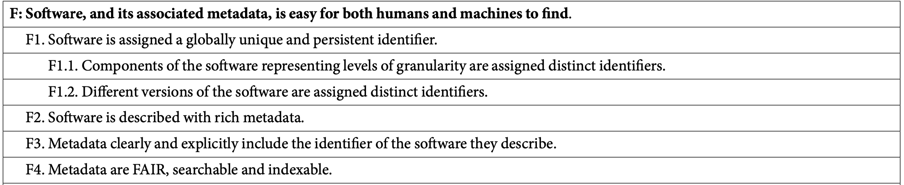
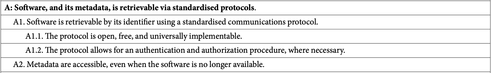
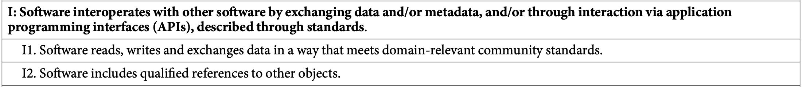
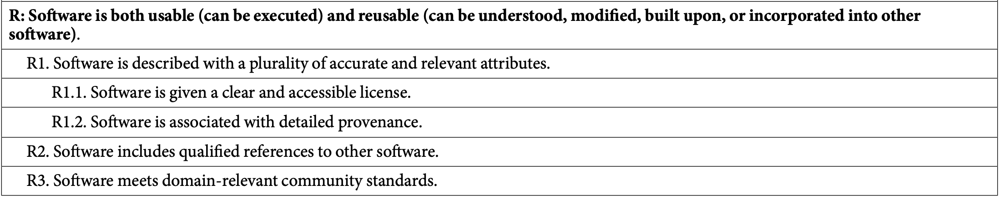

<!-- .slide: data-state="title" -->

# Software in the Scientific Landscape

===

<!-- .slide: data-state="standard center" -->
## Some general observations:

- Research depends on building on previous research
- Science increasingly depends on software/code
- Commercial software is often not *bleeding edge*
- Commercial software is often closed source
- Closed source software decreases flexibility
- Closed source software hides the research method
- **So** Scientists write software themselves 
- **But** Scientists are not trained as software engineers
- Software is not (yet) regarded as valuable research output

Note:

===

<!-- .slide: data-state="standard center" id="landscape" data-background-image="media/landscape.jpg" -->
## Landscape

note:
- Discuss diversity of research support and the current state of the landscape (still developing, lots of uncertainty, non-existence of policies and actual positions)
- Discuss reason why this is important and it should be on the agenda
- Discuss that they might not get any questions about this, because researchers are not aware. They don't know they should ask, or what to ask. This might change once NWO implements the software management plans as requirement for grant applications.

===

<!-- .slide: data-state="standard center" -->
## Initiatives

- Research Software Engineers
- Open Science 
- FAIR for Research Software 
- FOSS (Free and Open Source Software)(https://freeopensourcesoftware.org/)
- Software Heritage (https://www.softwareheritage.org/)
- Software Management Plan

Note:
There many initiatives related to research software which try to address these (previous slide) problems. 
Many of these initiatives are related, they sometimes overlap.

===

<!-- .slide: data-state="standard center" id="rse-world" -->
## The worldwide RSE movement

<small>[The national associations around the world as at 2023. (image courtesy of Ian Cosden, US RSE Association)](https://www.fz-juelich.de/en/rse/about/rse-worldwide)</small>

Note:
RSE stands for Research Software Engineer. This is a person that writes or contributes to Research Software. 
The community of RSE's is growing and many strive for recognition of the RSE trade and respecting software as scientific output. 

The eScience Center published their role description of RSEs in general and a job profile specific to RSEs at the eScience Center. 

===

<!-- .slide: data-state="standard center" -->
## Open Science

<small>[UNESCO Recommendation on Open Science, 2021](https://creativecommons.org/2021/12/02/unesco-recommendation-on-open-science-ratified/) (CC BY IGO 3.0)</small>

note:
Open Science encompasses many aspects of science.
It is a movement that aims to make science — which includes software — more open, transparent, and accessible.
This is supported by many organisations, including UNESCO.

===

<!-- .slide: data-state="standard center" -->
## The FAIR principles

note:
The FAIR principles standardize values that help openness, transparency, and accessibility.

===

<!-- .slide: data-state="standard center" -->

## FAIR (for data)

note:
FAIR principles were originally also with other digital objects in mind than just plain research data, though the actual description was very data-specific.
This has been extended meanwhile.

===

<!-- .slide: data-state="standard center" -->

## FAIR (for software)

Fair for Research Software (FAIR4RS) working group (2022)
[doi:10.1038/s41597-022-01710-x](https://doi.org/10.1038/s41597-022-01710-x)

note:
In 2022, the results of extensive community consultation were published in the FAIR for Research Software paper.
The group behind this was a collaboration between the Research Software Alliance, the Research Data Alliance, and FORCE11.

===

<!-- .slide: data-state="standard" -->

## FAIR (for software)

Note:
These are the interpretations given to the FAIR principles for software by the working group.
In many cases these are rephrased to better fit software, but in some cases they are also extended.

===

<!-- .slide: data-state="standard" -->

## Findability

- Archive on Zenodo for DOI and persistence 
  <small> Note that persistence on GitHub is not guaranteed!</small>
- Use (semantic) versioning with updates 
  <small> Zenodo assigns a DOI to each version </small>
- Include metadata, explicitly containing the DOI 
  <small> but also license, version, dependencies, etc. </small>
- Register the software in a community registry 
  <small> such as PyPI or CRAN, depending on the language/domain </small>

Note:
For software findability, a few things need to work together:

The software needs to be archived on a platform that provides a DOI and persistence. GitHub is not guaranteed to provide this, and while it is a useful tool is not a suitable archive for software.
GitHub does work well together with Zenodo, which provides both.
Together they also provide functionality for versioning: when releasing a new version on GitHub, and using the Zenodo integration, Zenodo will update the entry and assign a new DOI to the new version.

For software-specific findability, though, Zenodo is insufficient. Here, you can think of more specific registries, such as PyPI, CRAN, or Bioconductor; depending on the language and domain of the software.

===

<!-- .slide: data-state="standard" -->

## Accessibility

- Community registries provide standard download protocols 
  <small> e.g. `pip install my_software` </small>
- Metadata on Zenodo is part of the persistent archive

Note:
A lot of accessibility is covered by the findability principles, but there are a few additional things to consider.
Specifically, software may still be FAIR as long as its metadata is accessible.
The code of the software itself, not the actual functional engine, could be considered metadata.

===

<!-- .slide: data-state="standard" -->

## Interoperability

- Input and output both needs to meet community standards 
  <small> e.g. file formats, data models, ontologies </small>
- References to external objects should be unambiguous 
  <small> use URLs, DOIs, version numbers etc. </small>

Note:
As with data, interoperability refers partly to formats and standards (in this case: inputs, outputs, or other objects used). For example CSV, JSON, and XML are interoperable formats, while PDF is not.
These standards may also be domain-specific, such as the use of ontologies in the life sciences.

The second sub-principle refers to the use of unambiguous references to external objects, such as libraries, data, or models. A clear link allows the right object to be used by the software.

===

<!-- .slide: data-state="standard" -->

## Reusability

- Include a software-specific license 
  <small>as a file called `LICENSE` in the project's root</small>
- Many Open Source software licenses exist 
  <small> see [choosealicense.com](https://choosealicense.com/)</small>
- License choice is not always straightforward 
  <small> confirm with dependencies, copyright holder(s), and specialists </small>
- Use version control (e.g. Git) with a public host (e.g. GitHub) 
  <small> history and provenance is a public part of the repository </small>
- Dependencies should be listed, and unambiguous 
  <small> use a standardized file/protocol, and version numbers</small>

Note:
Licenses are an important part of reusability.
Without a license, copyright disallows reuse.
In an open science context especially, Open Source licenses are the default choice.
They are numerous, but the choice is not always straightforward.
It is advised to learn about the different licenses, about important considerations (e.g. dependencies and the role and identity of copyright holders) and to consult with specialists when in doubt.

===

### FAIR is not a quality checklist

Software quality is addressed insofar as it affects:

- usability, an aspect of interoperability
- maintainability, an important element of reuse

Quality aspects *not* part of FAIR:

- computational efficiency &nbsp;&nbsp;&nbsp;&nbsp;&nbsp;&nbsp;&nbsp;&nbsp;&nbsp;&nbsp;&nbsp;&nbsp;&nbsp;&nbsp;&nbsp;&nbsp;&nbsp;&nbsp;&nbsp;&nbsp;&nbsp;&nbsp;&nbsp;&nbsp;&nbsp;&nbsp;&nbsp;&nbsp;&nbsp;&nbsp;&nbsp;&nbsp;&nbsp;&nbsp;&nbsp;&nbsp;&nbsp;&nbsp;&nbsp;&nbsp;&nbsp;&nbsp;&nbsp;&nbsp;
- functional correctness
- security
- ...

Note:
The FAIR principles are limited in scope when it comes to software.
It is important to realize that their primary goal is not to address software quality itself.
FAIR software can be of poor quality, and good quality software may not be FAIR.

Some quality aspects are addressed by FAIR, in particular usability and maintainability.
Because software is dynamic and interdependent, its reusability requires that it is maintained to continue to work (or that a conserved context is provided, such as a virtual machine with required dependencies).

Secondary to maintainability are quality aspects like tests, modularized architecture, developer documentation, and so on.

Interoperable software is usable by others, and therefore it is important that it is well documented and that it is easy to install and run.
This ties into quality aspects like user documentation, installation instructions, and so on.

Note though, that there is no mention of correctness, nor of efficiency or security.
Software may adhere perfectly to FAIR, yet produce the wrong results, in a painfully slow and inefficient process, while leaking personal information.

===

<!-- .slide: data-state="standard" -->

## FAIR is a spectrum

Note:

FAIR is not a checklist, but a set of principles.
As such, it informs a spectrum of software sustainability, and not a binary "FAIR or not FAIR".

FAIR is not a perfect metric, but it is helpful, and tailored to specific values of open science.

===

<!-- .slide: data-state="standard" -->

## Take home messages

- Software is an important part of research
- FAIR4RS principles guide towards accessibility and openness of research software
- FAIR is not a quality checklist
- Software places unique demands on FAIR, and provides unique opportunities
- FAIRness is a spectrum

===

<!-- .slide: data-state="keepintouch" -->

www.esciencecenter.nl

info@esciencecenter.nl

020 - 460 47 70
