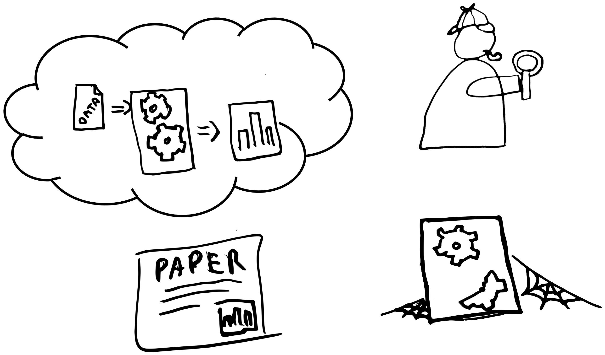
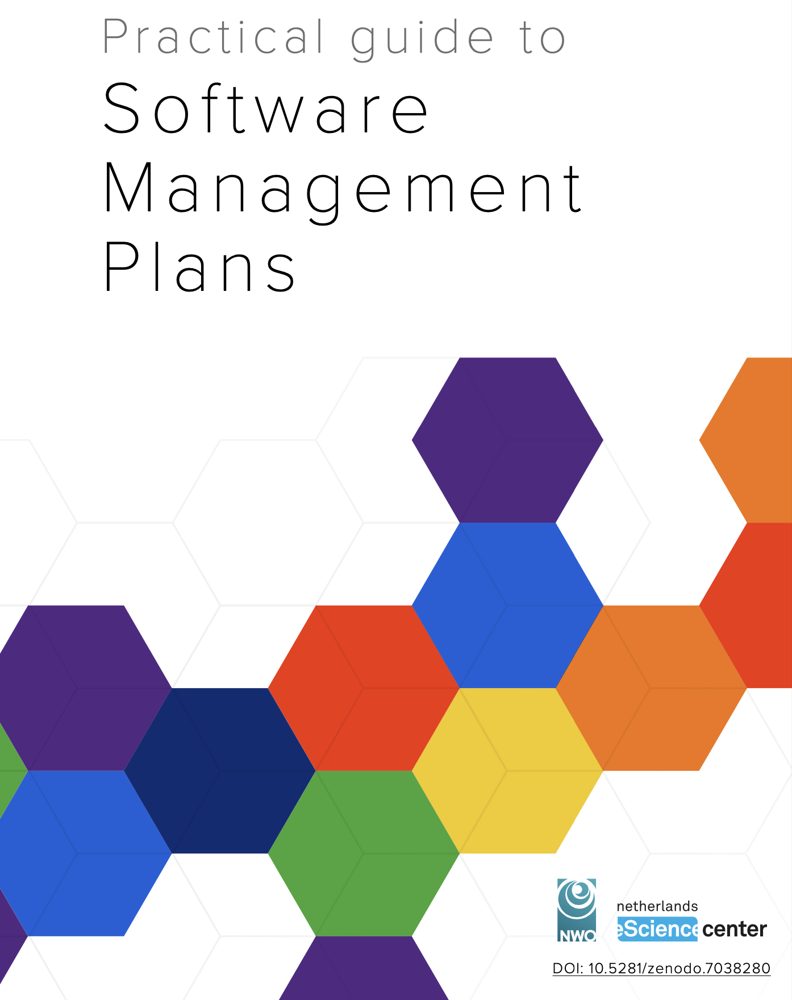
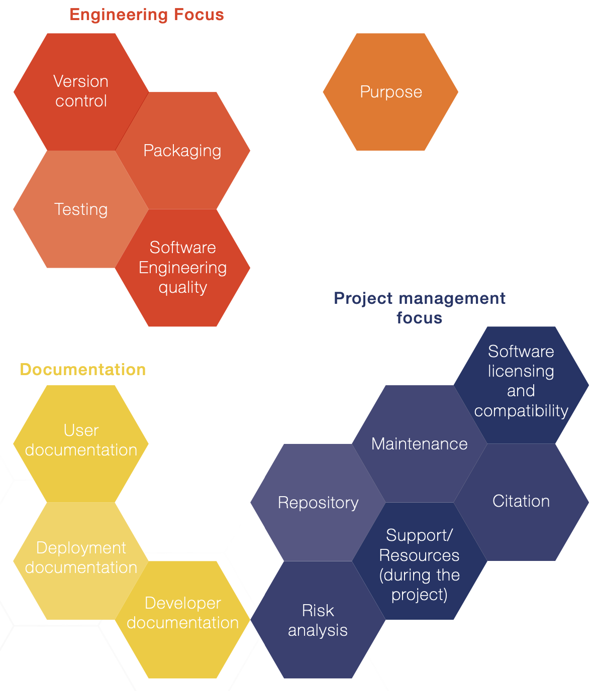
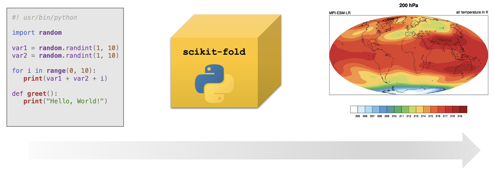
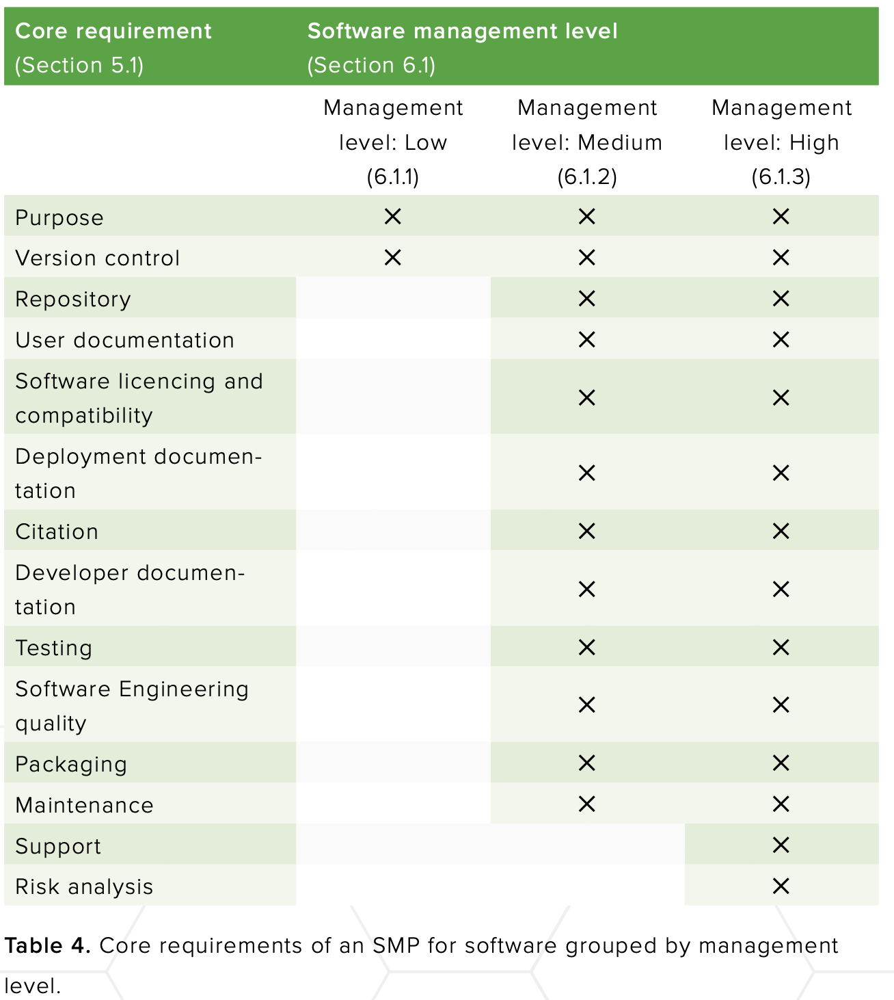

<!-- .slide: data-state="title" -->

# Software Management Plans

===

<!-- .slide: data-state="standard" -->

## Reusability & Reproducibility

These important values in research mean something slightly different for software than for data:
- **Reproducible** software can be re-run (by others) with consistent results.
- **Reusable** software can be built upon (by others) in their own packages.

<small>Image by <a href="https://github.com/c-martinez">Carlos Martinez-Ortiz</a></small>

For both, we need to be able to **find**, **access**, **use**, and **understand** software.

Note:
Software and code have some unique features.
One particular feature is that they depend on other software, and on the environment in which they are run.
This means that it requires maintenance and updates to keep it functional, as the environments around it change.
This is called software sustainability.

Reproducibility of research allows validation of its findings, and is therefore vital in building a solid foundation for scientific progress.
We can only truly build upon existing research if we can reproduce its results.

When software has been used in research, this has enormous potential to facilitate the research reproducibility.
However, it also comes with its own particular challenges: software reproducibility is not always straightforward.

An additional feature of software, is that it may be a product on its own, and can be reused by others.
This is a great opportunity to build on our collective knowledge and tools, and to avoid reinventing the wheel.

Ensuring that the software is findable, accessible, usable, and understandable is key to both reproducibility and reusability.

===

<!-- .slide: data-state="standard" -->

## Overview

- Software Management Plan: what and why?
- Aspects of software management
- Different needs for different software
- SMP template examples

Note:
This presentation will introduce you to the concept of software management plans, as a first step towards better software stewardship and sustainability.
We will look at different aspects of good software managements, as well as different needs for different types of software.
Finally, we will take a look at some concrete examples of software management plans.

===

<!-- .slide: data-state="standard" -->

### Software Management Plan (SMP)

- Building on the success of Data Management Plans (DMPs)
- A document detailing how research software will be managed
  - What does it do?
  - Who is it for?
  - What resources does it need?
  - Who is responsible?
  - How long will it be available?
  - ...
- Can be part of a project proposal or generated in the early phases
- Should be a "living document", to be updated as plans change

Note:
Software management plans (SMPs) are inspired by the earlier adopted data management plans.
In these documents, often created at or before the start of a project, plans and explicit decisions are made about various aspects around the management of these digital objects.
They are increasingly required by funders and institutions.

In an SMP it is explicitly stated what the software aims to do, who its target audience is, and what resources it is expected to need.
It also addresses the intended lifespan, and allocates responsibility: who makes releases? Who maintains the software at the end of the project, and if so for how long?

===

<!-- .slide: data-state="standard" -->

## Benefits of an SMP

SMPs should not be presented as addition bureaucratic hoops to jump through,
but rather as a tool allowing researchers to get the most out of their effort.  

An SMP helps ...
- thinking about the purpose and necessity (!) of the software;
- planning for requirement resources (human, financial, infrastrural, ...);
- providing clarity early on to avoid problems later
- structuring the development process of research software;
- making technical choices explicit, rather than rolling with the first idea;
- making and keeping research software accessible, reusable, and sustainable;

Note:

It is a common trap to present such documents to researchers and "force" them
to fill them in without too much context. This is then often perceived as a
bureaucratic burden that is not done with a lot of care or attention. 

Instead, we recommend presenting SMPs as an agent allowing researchers to
minimize their efforts, by making considerations early in the process and
working towards their goals, rather than having to make the call in the moment,
when there may be other priorities/deadlines (publication, grant application,
...)

With an SMP, you make explicit plans and decisions in an early stage.
The SMP provides the team with structured, relevant questions early on, with the aim to maximize the accessibility, reusability, and impact of the software in question.
This supports good software management practices, and it makes sure they are known to the researchers involved.

More specifically, in an SMP you:

- Make explicit technical choices. For example, what programming language will be used? What operating system will be supported?
- Plan for necessary resources; be they financial, human, infrastructure or other.
- Assess whether new software is really needed; explore whether existing software can be reused, and to what extent;

These are issues that arise during software development anyway, but all too often are not explicitly dealt with.
By tackling them early, a conscious decision can be made rather than needing to deal with consequences of implicit choices.
Resource planning moreover is vital for the sustainability of the software.
Finally, the SMP will allow later verification of plans in a publicly funded project.

===

<!-- .slide: data-state="standard" -->

[doi:10.5281/zenodo.7038280](https://doi.org/10.5281/zenodo.7038280)

Note:
To get started on creating a Software Management Plan, this practical guide has been created by NWO and the Netherlands eScience Center.
Its first version was released in August of 2022, but it has since been, and will continue to be, updated.
All past versions and the latest release are available on Zenodo via this DOI.

===

<!-- .slide: data-state="standard" -->

Note:
In the practical guide, the core requirements for an SMP are listed, and grouped into four foci:
- Purpose
- Engineering
- Documentation
- Project Management.

===

<!-- .slide: data-state="standard" -->

## SMP templates

- Should be provided by the institution
- Include guidance:
  - Instructions on how to fill it out
  - Resources for information and support
  - Institution-specific regulations
  - Institution-specific resources available
  - Who to contact for clarification/further information
- Include an assessment rubric (e.g. with (un)acceptable answers)

Note:
The Software Management Plan template is a duty of the institution.
A good SMP includes guidance on how to fill it out, including institution-specific regulations and resources.

An assessment rubric should accompany the template, indicating per question or focus what conditions need to be met, and which answers are (un)acceptable.

===

## Not all software is equal

Note:
It is important to realize when making an SMP, that research software comes in many shapes and sizes.

An ad-hoc R script written by a PhD student to analyse data from a specific machine, is research software.

It can also be a multinational collaboration to develop a tool that is used by thousands of researchers worldwide.

Different software has different needs, but there are common principles in managing them and ensuring their sustainability.

The diversity of research software does mean that not all requirements apply to every type of software.
To address this, we can subset the core requirements to create different SMP templates tailored to software with different management needs.

The SMP Guide distinguishes software with low, medium, and high management needs.

===

<!-- .slide: data-state="standard" -->

## Exercise: How important is it?

==

<!-- .slide: data-state="standard" -->

#### Consider the following list of software:

- [NEMO](https://www.nemo-ocean.eu/), a state of the art modelling framework, used for research and forecasting in ocean and climate sciences.
- [AlphaFold](https://alphafold.com/), an AI system developed by Google DeepMind that predicts a protein’s 3D structure from its amino acid sequence.
- A Jupyter notebook to get the average length of everyone in this classroom.
- A software package you yourself have been involved in, if any.
- [Facebook](https://www.facebook.com/), a social media platform connecting people globally.

Randomly choose 5 requirements and rate on a scale of 1-5 how important those aspects are to include in the SMP.
It is not necessary to look any of these up, give your best estimation given the stated information.

Note:
While teaching, we would usually do this exercise using a [mentimeter](https://www.mentimeter.com/app/folder/2612404)

===

<!-- .slide: data-state="standard" -->

## Making the call

Determine the management level, based on:  
  

1. **Purpose**: what is the reason or expected end-use for the software?
2. **Reliability**: what is the effect of software failure and/or non-maintenance?
3. **Maintenance**: what is the long-term effort needed to maintain the software?

An overview of the various management levels:
  

Note:
Deciding what level of management, and therefore which SMP template, is appropriate for a specific software project, is not always straightforward.
The practical guide provides some guidance on how to make this decision.
Addressing what purpose the software serves, how reliable it needs to be, and what efforts will be required for its longer term maintenance, will help determine the appropriate level of management.

Note that the requirements and categories listed are one example of what the division could look like, and in practice most project will fall between what is considered "low" and "medium" here!

==

<!-- .slide: data-state="standard" -->

## SMP level: low

For low management level projects, the SMP can be part of the DMP.

Purpose:
- Single purpose scripts
- Developer is the primary user
- Performs limited function:
  - Analyses a single/few experiment(s) or dataset(s)
  - Automates a simple routine task

Note:
Software with low management requirements is defined by its limited function: it performs a single analysis or automates a routine task.
Its **purpose** is typically limited to a specific experiment, and the developer is the primary user.

The **reliability** of this type of software is usually easy to assess: the output can be visually inspected, or tested with a limited set of inputs.

The **maintenance** of this type of software is usually limited to the duration of the project in which it was developed.
It is not intended to be used by others, and therefore its influence beyond the scope for which it was intended is likely small.

Best practices during development (e.g. version control), as well as measures to enable its reuse (documentation, versioning, archiving) are appropriate and recommended.
They are however not requirements, nor is long term maintenance planning necessary.

==

<!-- .slide: data-state="standard" -->

## SMP level: medium

- Primary or secondary output of a research project
- Adds a library or module to existing tool, or even works standalone
- Unique functionality that will be reused
  - Implements a new or higher performance algorithm
  - Simulation software implementing a new model or method

Note:
Software requiring **medium** management, is defined as software that is the primary or secondary output of a research project.

Its original **purpose** is typically limited to a single research project, but incorporates functionality that may be of use to others, either as a standalone tool, library, or module in an existing tool.

The **reliability** is more difficult to assess due to its increased complexity, but it is also also more important: this software likely has an effect on other research outside of the original project.
Good software practices such as version control and user/technical documentation are therefore essential here.
More advanced requirements, such as code auditing, automated testing, software packaging, and distribution also need to be considered.

This software's longer term **maintenance** is relevant as it will have a lifespan longer than the project in which it was developed.
Software management planning should include providing information on archiving and citation as well as strategies for post-project maintenance and support.

==

<!-- .slide: data-state="standard" -->

## SMP level: high

- "Mission critical" software
- High standards required for reliability
- Absence or replacement of the software would threaten research
- Software that is continually in use:
  - Preprocessing data coming from a telescope
  - Controlling a medical device

Note:
**High** management software is defined as mission critical software.

Its **purpose** is to perform a critical function, and its absence or replacement would threaten the research.

The **reliability** of this software is of utmost importance, and all possible actions should be taken to ensure it.

Its **maintenance** is not limited to the duration of the project in which it was developed, but should be maintained as long as it is in use.
Thus, maintenance strategies, including funding and/or community development plans, should be in place.

===

<!-- .slide: data-state="standard" -->

## Take home messages

- Software is found in all stages of the research cycle
- Research software comes in many shapes and sizes
- Software stewardship starts with a good plan
- Good software management leads to better science
- Institutes should provide one or more SMP templates

Note:
Software is found in all stages of the research cycle, and is used for many different purposes.
It comes in many shapes and sizes, and has different needs.
Software stewardship starts with a good plan, and is an important scientific step: good software management leads to better science.

===

<!-- .slide: data-state="keepintouch" -->

www.esciencecenter.nl

info@esciencecenter.nl

020 - 460 47 70
