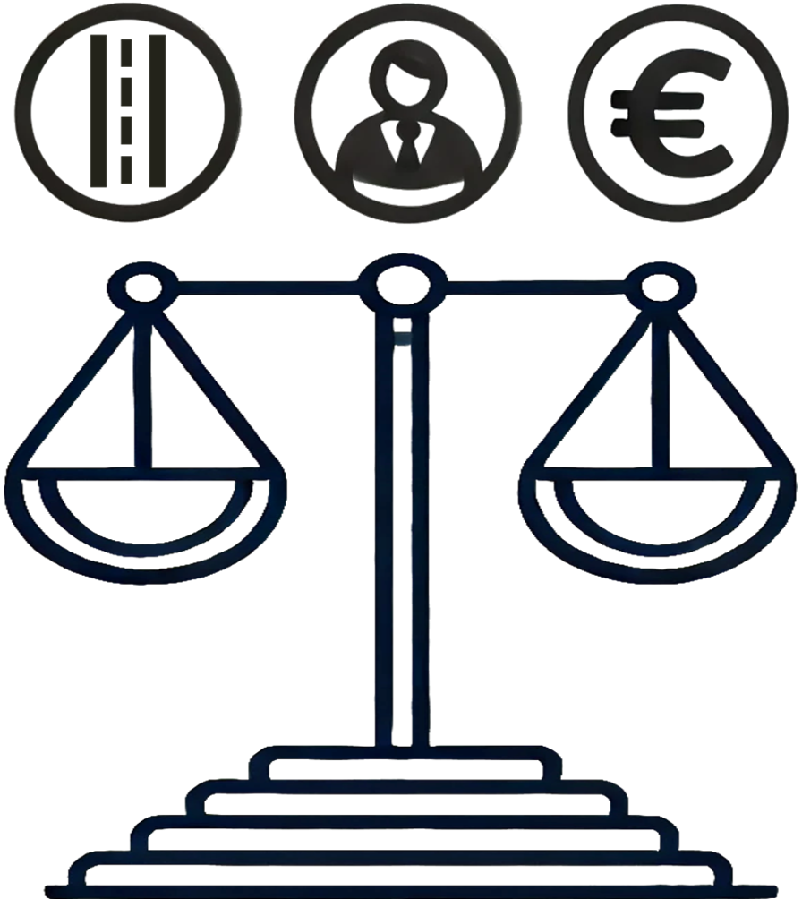

<!-- .slide: data-state="title" -->

# Software Management Plans

===

<!-- .slide: data-state="standard" -->

## Research reproducibility

<small>Image by <a href="https://github.com/c-martinez">Carlos Martinez-Ortiz</a></small>

What role does research software play in promoting reproducibility?

Note:
Reproducibility of research allows validation of its findings, and is therefore vital in building a solid foundation for scientific progress.
We can only truly build upon existing research if we can reproduce its results.

When software has been used in research, this has enormous potential to facilitate the research reproducibility.
However, it also comes with its own particular challenges: software reproducibility is not always straightforward.

===

<!-- .slide: data-state="standard" -->

## Software reusability

- Reproducibility relies on re-using research software.
  - Users need to **find**, **access**, and **use** the software.
- Reproduction may just be a first step towards diversifying a study.
  - Users need to **understand** the software.

Software reusability encompasses both **reproducing** existing results obtained with RS, as well as **building upon** existing RS to use it in new or different ways.

Software Management Plans help developers ensuring that their research software is reusable.

Note:
An additional feature of software, is that it may be a product on its own, and can be reused by others.
This is a great opportunity to build on our collective knowledge and tools, and to avoid reinventing the wheel.

Ensuring that the software is findable, accessible, usable, and understandable is key to both reproducibility and reusability.

Software needs to be understood both from a:
- functional perspective: what steps does the software take to get to the results
- developmental perspective: how are these steps put into code

===

<!-- .slide: data-state="standard" -->

## Overview

- Software Management Plan: what and why?
- Aspects of software management
- Different needs for different software
- SMP template examples

Note:
This presentation will introduce you to the concept of software management plans, as a first step towards better software stewardship and sustainability.
We will look at different aspects of good software managements, as well as different needs for different types of software.
Finally, we will take a look at some concrete examples of software management plans.

===

<!-- .slide: data-state="standard" -->

### Software Management Plan (SMP)

- Building on the success of Data Management Plans (DMPs)
- A document detailing how research software will be managed
  - What does it do?
  - Who is it for?
  - What resources does it need?
  - Who is responsible?
  - How long will it be available?
  - ...
- Can be part of a project proposal or generated in the early phases
- Should be a "living document", to be updated as plans change

Note:
Software management plans (SMPs) are inspired by the earlier adopted data management plans.
In these documents, often created at or before the start of a project, plans and explicit decisions are made about various aspects around the management of these digital objects.
They are increasingly required by funders and institutions.

In an SMP it is explicitly stated what the software aims to do, who its target audience is, and what resources it is expected to need.
It also addresses the intended lifespan, and allocates responsibility: who makes releases? Who maintains the software at the end of the project, and if so for how long?

===

<!-- .slide: data-state="standard" -->

## An SMP helps ...

  

    
    ... thinking about purpose & necessity
  

  

    
    ... planning resource management
  

  

    
    ... avoiding problems later
  

  

    
    ... structuring development
  

  

    
    ... making technical choices explicit
  

  

    
    ... keeping research software alive
  

<small>Images generated by OpenAI's DALL·E 3 model via ChatGPT v2 and subsequently adapted by <a href="https://github.com/DaniBodor">Dani Bodor</a>.</small>

Note:

With an SMP, you make explicit plans and decisions in an early stage.
The SMP provides the team with structured, relevant questions early on, with the aim to maximize the accessibility, reusability, and impact of the software in question.
This supports good software management practices, and it makes sure they are known to the researchers involved.

More specifically, in an SMP you:

- Make explicit technical choices. For example, what programming language will be used? What operating system will be supported?
- Plan for necessary resources; be they financial, human, infrastructure or other.
- Assess whether new software is really needed; explore whether existing software can be reused, and to what extent;

These are issues that arise during software development anyway, but all too often are not explicitly dealt with.
By tackling them early, a conscious decision can be made rather than needing to deal with consequences of implicit choices.
Resource planning moreover is vital for the sustainability of the software.
Finally, the SMP will allow later verification of plans in a publicly funded project.

===

<!-- .slide: data-state="standard" -->

## An SMP is not ...

an additional bureaucratic hoop for researchers to jump through.

Make sure you represent it as a tool allowing researchers to get the most out of their effort.  

Note:

It is a common trap to present such documents to researchers and "force" them
to fill them in without too much context. This is then often perceived as a
bureaucratic burden that is not done with a lot of care or attention. 

Instead, we recommend presenting SMPs as an agent allowing researchers to
minimize their efforts, by making considerations early in the process and
working towards their goals, rather than having to make the call in the moment,
when there may be other priorities/deadlines (publication, grant application,
...)

===

<!-- .slide: data-state="standard" -->

[doi:10.5281/zenodo.7038280](https://doi.org/10.5281/zenodo.7038280)

Note:
To get started on creating a Software Management Plan, this practical guide has been created by NWO and the Netherlands eScience Center.
Its first version was released in August of 2022, but it has since been, and will continue to be, updated.
All past versions and the latest release are available on Zenodo via this DOI.

===

<!-- .slide: data-state="standard" -->

Note:
In the practical guide, the core requirements for an SMP are listed, and grouped into four foci:
- Purpose
- Engineering
- Documentation
- Project Management.

===

<!-- .slide: data-state="standard" -->

## SMP templates

- Should be provided by the institution
- Include guidance:
  - Instructions on how to fill it out
  - Resources for information and support
  - Institution-specific regulations
  - Institution-specific resources available
  - Who to contact for clarification/further information
- Include an assessment rubric (e.g. with (un)acceptable answers)

Note:
The Software Management Plan template is a duty of the institution.
A good SMP includes guidance on how to fill it out, including institution-specific regulations and resources.

An assessment rubric should accompany the template, indicating per question or focus what conditions need to be met, and which answers are (un)acceptable.

===

## Not all software is equal

Note:
It is important to realize when making an SMP, that research software comes in many shapes and sizes.

An ad-hoc R script written by a PhD student to analyse data from a specific machine, is research software.

It can also be a multinational collaboration to develop a tool that is used by thousands of researchers worldwide.

Different software has different needs, but there are common principles in managing them and ensuring their sustainability.

The diversity of research software does mean that not all requirements apply to every type of software.
To address this, we can subset the core requirements to create different SMP templates tailored to software with different management needs.

The SMP Guide distinguishes software with low, medium, and high management needs.

===

<!-- .slide: data-state="standard" -->

## Exercise: How important is it?

Note:
While teaching, we will usually do this exercise using [mentimeter](https://www.mentimeter.com/app/folder/2612404) (this link is only accessible using an eScience Center account). It is not necessary to go to the slides vertically below this one.

For self-studiers: see slides vertically below this one to see the exercise.

==

<!-- .slide: data-state="standard" -->

#### Consider the following list of software:

- [NEMO](https://www.nemo-ocean.eu/), a state of the art modelling framework, used for research and forecasting in ocean and climate sciences.
- [AlphaFold](https://alphafold.com/), an AI system developed by Google DeepMind that predicts a protein’s 3D structure from its amino acid sequence.
- A Jupyter notebook to get the average length of everyone in this classroom.
- A software package you yourself have been involved in, if any.
- [Facebook](https://www.facebook.com/), a social media platform connecting people globally.

Go to next slide

Note:

We recommend scrolling up and down between this and previous slide to do the exercise.

==

<!-- .slide: data-state="standard" -->

#### How important are the different requirements for each?

- Randomly choose 5 SMP requirements for each software from the previous slide
- Rate on a scale of 1-5 how important those aspects are to include in the SMP.
    - It is not necessary to look them up, make an estimation from stated information.

Note:

We recommend scrolling up and down between this and previous slide to do the exercise.

===

<!-- .slide: data-state="standard" -->

## Making the call

Not all SMPs need to encompass every single requirement, this will generally depend on:
  - **Purpose**: what is the reason or expected end-use for the software?
  - **Reliability**: what is the effect of software failure and/or non-maintenance?
  - **Maintenance**: what is the long-term effort needed to maintain the software?

DCCs or organizations need to decide how it is determined which requirements to include and who is responsible for the decision.

==

<!-- .slide: data-state="standard" -->

## Example 1: Templates per "management level"

DCCs create a few SMP templates based on the management level of software
<small> (example from SMP guide, we recommend making a variation of this theme)</small>

  <ul>
    <strong>Management level</strong>:
    <li><strong>Low</strong>: single purpose/single user script with limited functionality</li>
    <li><strong>Medium</strong>: primary research output with unique functionality may be reused</li>
    <li><strong>High</strong>: mission critical software in continuous use, failure of which would threaten research line</li>
  </ul>

Note:
In practice, we recommend creating more groups and/or redefining which requirements belong to each category (in the current form most software will fall in between Low and Medium). 

==

<!-- .slide: data-state="standard" -->

## Example 2: Guidelines per requirement

DCCs provide a guidelines for each requirement in which cases it should or should not be included in the SMP

For example:
- **Purpose**: Always include.
- **User Documentation**: If you want or expect users other than your direct colleagues to interact with the software.
- **Citation**: If you would like the software to be citable independently of e.g. research paper.
- **Risk analysis**: For mission critical software or software that needs to run 24/7.

===

<!-- .slide: data-state="standard" -->

## Take home messages

- Software is found in all stages of the research cycle
- Research software comes in many shapes and sizes
- Software stewardship starts with a good plan
- Good software management leads to better science
- Institutes should provide one or more SMP templates or guidelines

Note:
Software is found in all stages of the research cycle, and is used for many different purposes.
It comes in many shapes and sizes, and has different needs.
Software stewardship starts with a good plan, and is an important scientific step: good software management leads to better science.

===

<!-- .slide: data-state="keepintouch" -->

www.esciencecenter.nl

info@esciencecenter.nl

020 - 460 47 70
