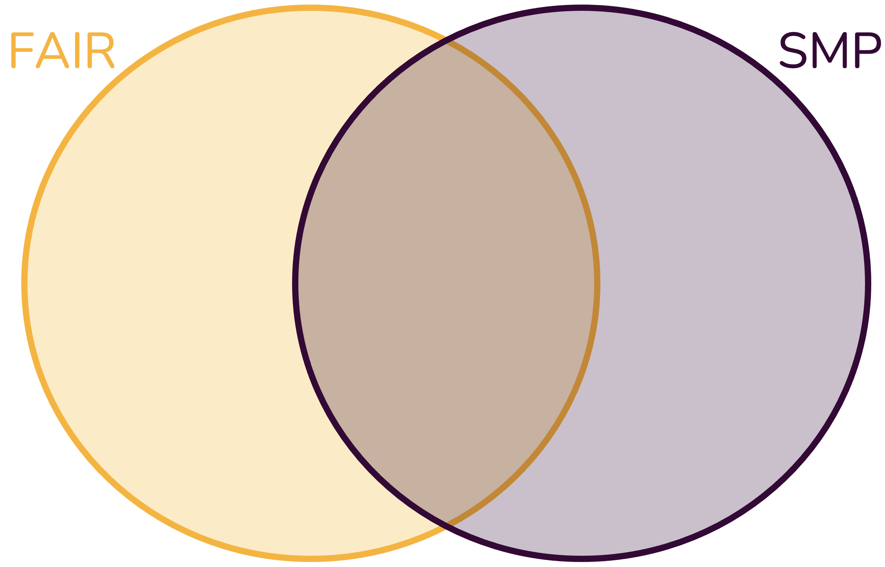

## SMP vs FAIR

### Why do we care?

When thinking of the importance of good software stewardship, management, and development practice, many reasons and motivations come to mind.
You may think of:

- Accuracy of results
- Reproducibility of results
- Reusability of software
- User friendliness of software
- Software quality
- Recognition and rewards for software developers
- Scholarly archive
- Software sustainability

Do any other reasons or motivation come to mind?
For each reason, score how generally applicable they are to research software:
1 = all, 2 = most, 3 = some, 4 = rarely, 5 = never

### Mapping motivations

(**NB:** If you are not yet familiar with the FAIR principles for research software, take a look at the chapter on [Software Landscapes](/modules/softwarelandscape/slides) before doing the following exercise.)

The motivations we listed above were important considerations for the development of Software Management Plans as well as the FAIR principles for research software.
They do not match completely, however.
Each has its own focus and emphasis.

In the following exercise, we will map the motivations we listed above to the ultimate goals of SMPs and the FAIR principles.

Draw a Venn diagram with two circles: SMP and FAIR:

Map the motivations listed above to the Venn diagram.

- Which motivations are covered by SMPs, which by FAIR, and which by both?
- Do you find any motivations that are not covered by either?
- What does this tell you about the relationship between SMPs and FAIR?
