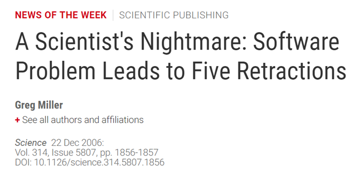
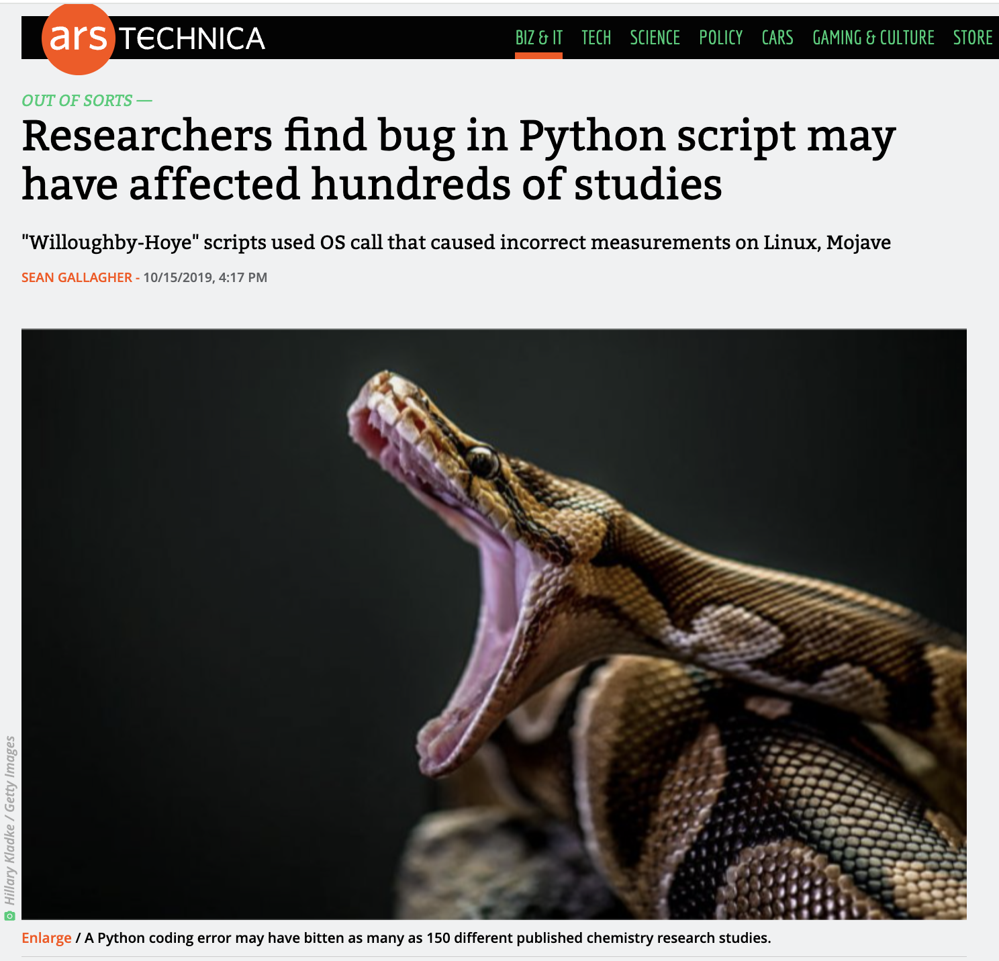
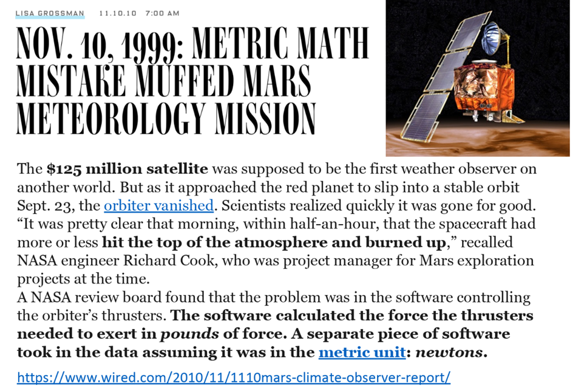
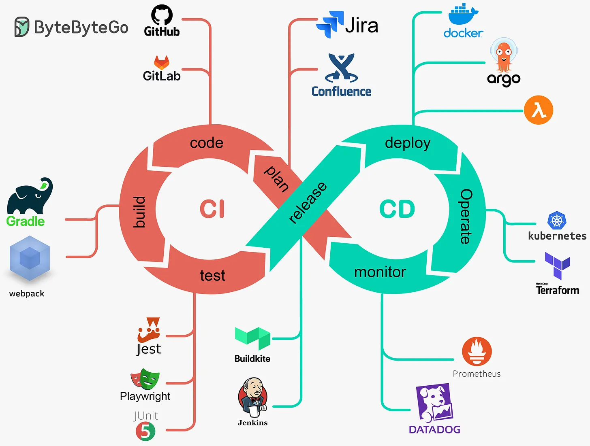
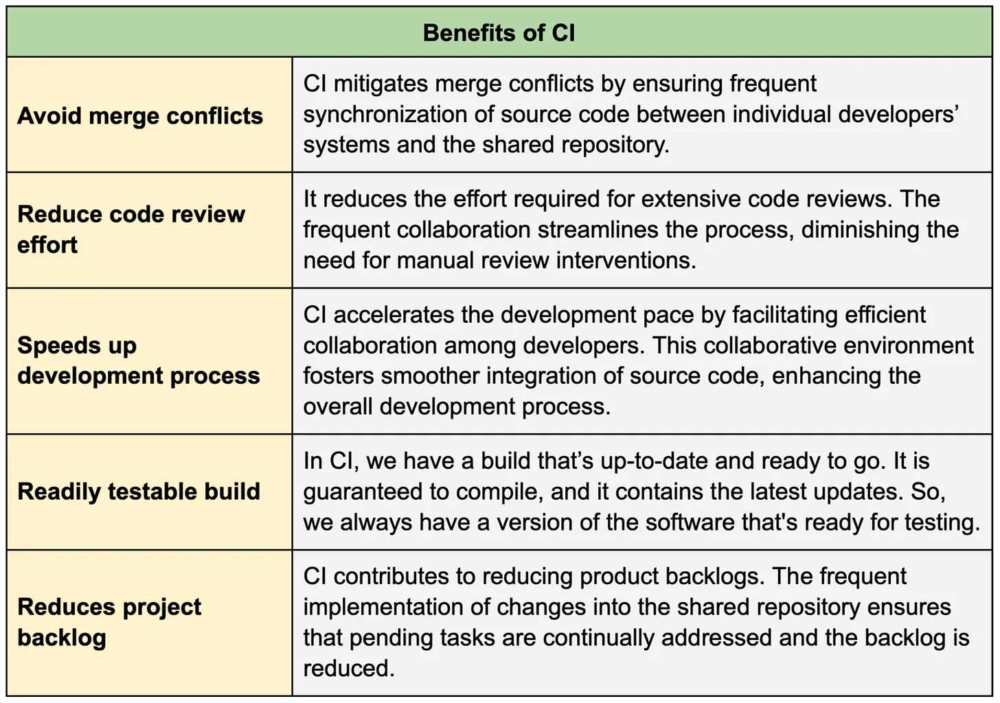

<!-- .slide: data-state="title" -->

## Software Testing

===

<!-- .slide: data-state="standard" -->

## What is software testing?

> “Software testing is the process of evaluating and verifying that a software product or application does what it’s supposed to do. The benefits of good testing include preventing bugs and improving performance.”

<small>[From IBM Featured Topics](https://www.ibm.com/topics/software-testing) </small>

Note:

What is software testing?

Software testing is the process of evaluating and verifying that a software and its components meet specified requirements and work as expected. Its primary purpose is to identify defects, errors, flaws, or bugs early in the development process.

Software testing can be done manually, where a human actively uses the software to observe for defects, or automatically, where test scripts or tools are used to execute tests.

Untested software can be compared to uncalibrated experimental devices.

===

<!-- .slide: data-state="standard" -->

## Risks of poorly tested (research) software

<small> Find the complete articles [here](https://www.science.org/doi/full/10.1126/science.314.5807.1856), [here](https://arstechnica.com/information-technology/2019/10/chemists-discover-cross-platform-python-scripts-not-so-cross-platform/), and [here](https://www.wired.com/2010/11/1110mars-climate-observer-report/) </small>

Note:

There are several examples in which the lack of proper software testings resulted in serious consequences.

The first article from 2006 reports about a software flaw (a plus sign in place of a minus sign) that lead to a retraction of 5 scientific articles.

In the second from 2019, researchers found that a programming error in a set of Python scripts commonly used for computational analysis of chemistry data returned varying results based on which operating system they were run on—throwing doubt on the results of more than 150 published chemistry studies.

The loss of the Mars Climate Orbiter in 1999 is another prominent example of a catastrophe caused by a software error, specifically a unit conversion mistake.

There is also the case of the Ariane flight V88, an European Space Agency rocket which was destroyed just 40 seconds after its launch due to a software bug; see https://en.wikipedia.org/wiki/Ariane_flight_V88.

===

<!-- .slide: data-state="standard" -->

## Why test your software ?

- Ensure software reliability, validity, and reproducibility.
- Confirm correct installation and demonstrate use.
- Boost developer confidence for contributions and modifications.
- Maintain expected software functionality.
- Simplify and manage code complexity.

Note:

Why testing your software is so crucial?

Specifically for research software, tests are vital for ensuring the reliability, validity, and reproducibility of your scientific results.

They help users by enabling them confirm that the software is installed correctly, providing usage examples.

Tests also help other developers modify and contribute to your software. A good test suite gives collaborators confidence to make modifications without breaking existing functionalities.
They preserve the expected functionality of the software.

Manage complexity: Code that is easy to test is often easier to understand and maintain.

===

<!-- .slide: data-state="standard" -->

## Types of testing

- **Unit tests**: Assess individual components for correctness.
- **Integration tests**: Verify interactions between different parts of the software.
- **System tests**: Evaluate the complete and integrated software system.
- **Regression tests**: Ensure new changes don’t disrupt existing functionality.

Note:

There are several types of software testing, each of which with its own purpose.

In unit tests each individual unit of a software is tested separately. The purpose is to ensure that each component of the software works as expected.

Integration tests are a level of software testing where individual units are combined and tested as a group. The purpose of this level of testing is to expose faults in the interaction between integrated units.

The complete, integrated system is checked via the so-called system tests. The purpose here is to evaluate whether the software as a whole gives the correct outputs for given inputs.

Finally, regression tests check for unexpected side-effects in existing features after changes.

===

<!-- .slide: data-state="standard" -->

## Continuous Integration and Continuous Deployment (CI/CD)

Note:

Continuous Integration (CI) is a practice in software development where team members regularly integrate their individual code changes, often several times a day, into a shared remote repository. After every integration, a working version of the project is build and the software's test suite is run automatically, making it possible to identify defects, errors, flaws, or bugs introduced by changes early in the development process. This helps keep the code up-to-date and reduces the chances of major issues when combining everyone's work.

Continuous deployment (CD) is the next step after CI in the CI/CD pipeline shown in the figure. CD is the practice of automatically deploying every working version of the project that passes the automated testing phase to its end-users.

===

<!-- .slide: data-state="standard" -->

## Benefits of continuous integration

===

<!-- .slide: data-state="standard" -->

## Take home messages

- Software testing is key for quality, reliability, and reproducibility
- Unit tests verify individual components, integration tests check component interactions
- CI/CD streamline development and enhance deployment efficiency.

===

<!-- .slide: data-state="keepintouch" -->

www.esciencecenter.nl

info@esciencecenter.nl
