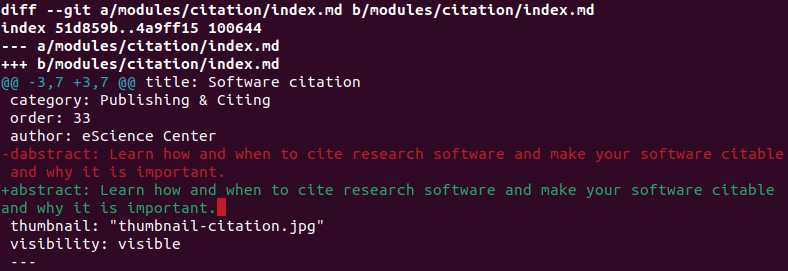
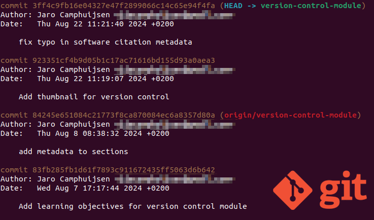

<!-- .slide: data-state="title"  -->

# Version Control

What is version control and why should I use it?

note:
You are probably using version control every day. Word documents store a history of changes for you, which you can undo. 

===

<!-- .slide: data-state="standard center" -->


<small> "Piled Higher and Deeper” by Jorge Cham, http://www.phdcomics.com </small>

===

<!-- .slide: data-state="standard center"  -->
## Documents are...

<div >
  a series of changes
  
</div>

note:
In version control systems, documents start with a base version and record all the changes that happened on top of that base version. Because of this you can always "play back" to an earlier version, while it does not store duplicates.

===


<!-- .slide: data-state="standard center" -->

## Changes are stored



note:
A version control system (like git) keeps track of the individual changes for us. 

===

<!-- .slide: data-state="standard center" -->

## Changes are stored



note:
The changes are stored along with some useful metadata. A set of changes, along with its metadata is called a "commit". 

===

<!-- .slide: data-state="standard" -->
## More than one...

<div style="float: left; width: 49%;">
  independent changes
  
</div>

<div style="float: right; width: 49%;">
  can be merged
  
</div>

note:
When collaborating you might have various versions (sets of changes) that co-exist at the same time on so called "branches".

As long as the changes are not made to the same section (line of text) in a document (**conflict!**), the various changes can be merged together. 

===

<!-- .slide: data-state="standard" -->
## Merge conflicts

However, if multiple contributors work on the same thing...

```bash
This line contains a typos.
```
<!-- .element: class="fragment" data-fragment-index="1" -->

... then "merge conflicts" may arise: 
<!-- .element: class="fragment" data-fragment-index="2" -->

```bash
<<<<<<< contributor1
This line contains typos.
=======
This line contains a typo.
>>>>>>> contributor2
```
<!-- .element: class="fragment" data-fragment-index="2" -->

===

<!-- .slide: data-state="standard center" -->
## Collaboration


<small>[The five pillars of computational reproducibility: Bioinformatics and beyond](https://www.researchgate.net/figure/Distributed-version-control-Adapted-from-48_fig2_371671830)</small>


note:
Collaborative code developers often make use of a remote server (like GitHub, or GitLab) as a central repository from which all other repositories derive. But this is not the only way you can use version control to do collaborative development. 

===

<!-- .slide: data-state="standard" -->
## Some terminology

Files can be stored in:
 - **working directory**: the files you can see
 - **staging area / index**: files about to be committed
 - **local repository**: the permanent record
 - **remote repository**: a copy of the repository which is stored online and often acts as the central repository

===

<!-- .slide: data-state="standard center" -->

## The right tool?


note:
Many different tools exist specifically for collaborative version control of computer source code and other simple text-based documents. It is often good to know what is the default or most-used tool in your university, institute or group. 

Git (for version control) with Gitlab and Github (for collaboration) are the mainstream, used by many and with lots of features. You might run into projects using other repositories.

===

<!-- .slide: data-state="standard" -->
## Key Points
- Version control is like unlimited **undo** in MS Word, and more
- Version control also allows many people to work in parallel
- For collaborative development a remote, cloud hosted repository is often used as central hub

