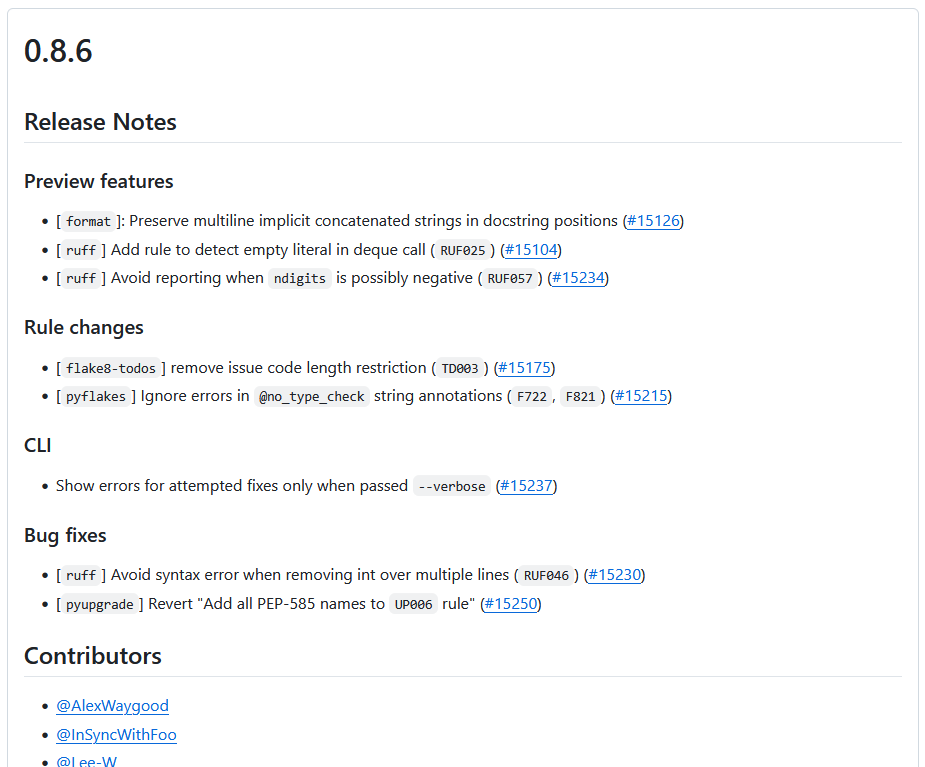
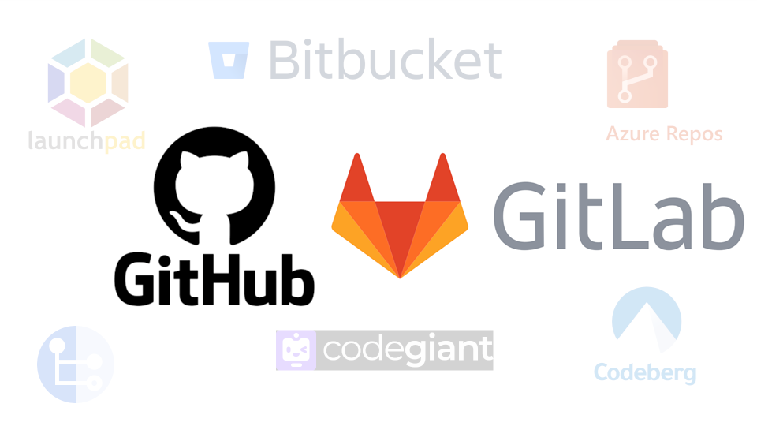
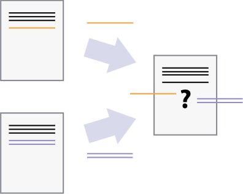

<!-- .slide: data-state="title"  -->
# Version Control

What is version control and why should I use it?

note:
You are probably using version control every day. Word and other documents store a history of changes for you, which you can undo. Google docs have an even more intricate system of reviewing history, etc.

===

<!-- .slide: data-state="standard center" -->
### Version Control

*A system that organizes and records changes to a (set of) file(s) and/or their metadata over time, allowing one to
revisit specific versions later.*

<div class="fragment" data-fragment-index="1">
  
  <small> <a href="http://www.phdcomics.com">Piled Higher and Deeper</a> by Jorge Cham </small>
</div>

note:
Strictly speaking, this is a form of version control: separate versions are stored, commented on, and organized in some way.

Lets see a more practical, systematic, and robust way of doing this...

===

<!-- .slide: data-state="standard center"  -->
## Documents are...

<div>
  ... a series of changes
  
</div>

note:
In version control systems, documents start with a base version (which may or may not be empty) and record all the changes that happened on top of that base version. Because of this you can always "play back" to an earlier version or compare separate iterations, without having to store near-identical variations of the same documents.

==

<!-- .slide: data-state="standard center"  -->
## Software is...

... a collection of one or more documents.

- Code
- Documentation
- Environment & infrastructural files
- ...


note:
Any piece of code is nothing more than a (plain) text document, not too different from a word file. The same is generally true for most other files comprising the software. Therefore, changes are excessively easy and computationally efficient to track.

Even complex (binary, data, image, ...) files can ultimately be rendered in plain text, and therefore tracked using version control. Although changes are not easy to visualize and it will require multiplying the data storage for each change.

===

<!-- .slide: data-state="standard center" -->
## Changes...

... are stored using a version control (VC) system (usually `git`).


A single unit of change is called a [commit](version_control_terminology), and is typically associated with a brief [commit message](version_control_terminology), [commit hash](version_control_terminology) (SHA), and other metadata.
<!-- .element: class="fragment" data-fragment-index="1" -->

note:
Commit hashes are unique references to a commit, while commit messages are human readable descriptions. Other metadata can include the author(s), timestamp, etc.

==

<!-- .slide: data-state="standard center"  -->
## A commit...

... can be of any size or type:

- Single line additions/deletions/changes
- Additions/deletions/changes of (multiple) large sections
- Adding or deleting files
- Moving files into different folders
- ...

note:
A commit is the fundamental unit of change in version control, but its scope is not strictly defined. 

Ideally, a commit should be large enough to represent a meaningful improvement while remaining small enough to focus on a single, coherent change. Balancing these factors helps maintain clarity and makes it easier to track, review, and revert changes when needed.

==

<!-- .slide: data-state="standard center" -->
## Sequential commits...

... form a log

The data structure that contains the software plus the commit history is called a [repository](version_control_terminology).


note:
A good rule of thumb for commit sizing is whether you can write a clear, concise commit message summarizing the change. If the commit is too small, the message will simply describe the specific action taken. If it's too large, summarizing it succinctly becomes difficult. Striking the right balance ultimately also allows the commit log to be read almost like a history book.

===

<!-- .slide: data-state="standard" -->
## Keeping track

#### Question:
Say you have dozens (hundreds, thousands, ...) of old versions, how do you manage to find a specific/useful previous version?

- Effective committing (sizing & messages)
<!-- .element: class="fragment" data-fragment-index="1" -->
- Versioning systems
<!-- .element: class="fragment" data-fragment-index="1" -->
- Create Change logs and DOIs for stable/important versions
<!-- .element: class="fragment" data-fragment-index="1" -->

note:
We've talked above extensively about commit hygeine, so will now discuss the other 2 aspects.

==

<!-- .slide: data-state="standard" -->

## Versioning

Use a logical system to keep track of (stable) versions
... and document the system used in the repository.

<div>
  <ul>
    <div class="fragment" data-fragment-index="1" style="text-align: center;">
      <strong>Common systems</strong>:
    </div>
    <div class="fragment" data-fragment-index="1">
      <li><a href="https://semver.org/">Semantic Versioning (SemVer)</a>:
        <ul>
          <li>4.3.12 = major.minor.patch</li>
          <li>pro: version numbers have a functional relevance</li>
          <li>con: users must keep track of the precise version used</li>
        </ul>
      </li>
    </div>
    <div class="fragment" data-fragment-index="2">
      <li><a href="https://calver.org/">Calendar Versioning (CalVer)</a>:
        <ul>
          <li>2025.02.03 = YYYY.MM.DD</li>
          <li>pro: simpler implementation</li>
          <li>con: development is usually not as linear as this system implies</li>
        </ul>
      </li>
    </div>
  </ul>
</div>

note:
Not every change or addition needs a new version number; this is what commits are for.

Make sure that whatever versioning system you use is also documented in the repo, so that others (and future you) can see what the logic is.

<!-- TODO: is there a way to make the entire list a single element using md comments rather than defining it as a div? That would make above much more readable. -->

==

<!-- .slide: data-state="standard" -->
## Change logs & DOIs

Keep a human readable log summarizing the changes of each new version.

Host versions on servers such as [Zenodo](https://zenodo.org/) or [GitHub](https://github.com/)/[GitLab](https://gitlab.com/) to generate a DOI.


<small>Excerpt of release notes for <a href="https://github.com/astral-sh/ruff/releases/tag/0.8.6">ruff linter v0.8.6</a></small>

note:

This is the equivalent of the "commit message" at the level of a new version.

There are a few (near) synonyms used for this: change log, release notes, change history, etc. However, it is separate from the commit log or commit history, as per the comment above.

===

<!-- .slide: data-state="standard center" -->
## Collaborating using VC

More than one...
<!-- .element: class="fragment" data-fragment-index="0" -->

<div style="float: left; width: 49%;" class="fragment" data-fragment-index="1">
  ... source of change...
  
</div>

<div style="float: right; width: 49%;" class="fragment" data-fragment-index="2">
  ... can be merged.
  
</div>

note:
When collaborating you might have various versions (sets of changes) that co-exist at the same time on so called "branches". Modern version control software can usually automatically merge multiple changes into a single document.

==

<!-- .slide: data-state="standard center" -->
## Branching

A project can have many [branches](version_control_terminology), which may or may not get [merged](version_control_terminology) back into the main version.


<small> Image by: <a href="https://book.the-turing-way.org/reproducible-research/vcs/vcs-workflow-branches">The Turing Way</a></small>

**What uses can you think of to create branches, other than "feature branches"?**
<!-- .element: class="fragment" data-fragment-index="1" -->

note:
The main branch is supposed to be a stable version, that one can mostly rely on to work as expected. Changes created in branches may get merged back into the stable version, or may persist (or die) as a parallel version
Branches here are indicated as "feature branches", i.e. branches used while creating new features in a code base.

Other uses of branches:
- a sandbox or playground, for trying out different things without "damaging" the stable version
- organizing/storing results alongside their different variations/settings
- release management
- custom/user specific changes
- ...

==

<!-- .slide: data-state="standard center" -->
## Keeping a centralized repository


<small>[The five pillars of computational reproducibility: Bioinformatics and beyond](https://www.researchgate.net/figure/Distributed-version-control-Adapted-from-48_fig2_371671830)</small>


note:
Collaborative code developers often make use of a remote server (like GitHub, or GitLab) as a central repository from which all other repositories derive. But this is not the only way you can use version control to do collaborative development.

Separate local repositories are similar to but distinct from individual branches of the main repository.

==

<!-- .slide: data-state="standard center" -->
## Hosting the main repository

 <!-- non-focused image can be found until SHA 8c658f43, v1.6.0 -->


note:
Many different tools exist specifically for collaborative version control of computer source code and other simple text-based documents.

Git (for version control) with GitLab and GitHub (for collaboration) are the mainstream, used by many and with lots of features. We recommend against using any of the other tools unless the users already know what they are doing or have very strong reasons for sticking to them.

GitLab is fully open source and allows for setting up private environments (#TODO: lookup the terminology). Conversely, GitHub is owned by Microsoft and uses (some) proprietary software components, but is more widely used and more people will be familiar with the interface and functionality.

===

<!-- .slide: data-state="standard center" -->
## What can go wrong?



note:
If changes are made to the same section (usually the same or consecutive line(s) of text) of a document a [merge conflict](version_control_terminology) arises. Changes cannot be automatically merged, as the interpreter does not know which version or which combination to use. Human intervention is required and can involve rolling back a change, finding common ground between changes, etc.

Resolving merge conflicts can be time-consuming and error prone, especially for large conflicts. Therefore it is a good idea for teams to agree on some basic practices to avoid creating conflicts in the first place.

==

<!-- .slide: data-state="standard" -->
## Merge conflicts

If two people change the same line...

```bash
This line contains a typos.
```
... [merge conflicts](version_control_terminology) may arise:
<!-- .element: class="fragment" data-fragment-index="2" -->

```bash
<<<<<< HEAD (Current Change)
This line contained a typo.
=======
This line contained typos.
>>>>>> feature-branch (Incoming Change)
```
<!-- .element: class="fragment" data-fragment-index="2" -->

note:

If changes are made to the same section (usually the same or consecutive line(s) of text) of a document a [merge conflict](version_control_terminology) arises. Changes cannot be automatically merged, as the interpreter does not know which version or which combination to use. Human intervention is required and can involve rolling back a change, finding common ground between changes, etc.

Resolving merge conflicts can be time-consuming and error prone, especially for large conflicts. Therefore it is a good idea for teams to agree on some basic practices to avoid creating conflicts in the first place.

==

<!-- .slide: data-state="standard center" -->
## Avoiding merge conflicts

How to minimize creating merge conflicts:

- !! Communication !!:
  - discuss who is working on what
  - follow existing (or agree on common) code standards such as formatting, style guides, etc.
- Frequent updates:
  - [push and pull](version_control_terminology) each other's changes regularly.
- Organize changes:
  - use "feature branches" rather than making changes to the main document directly
  - avoid "scope creep" and instead create separate independent branches for isolated topics
  - review each other's changes before merging them
- Use (automated) tools to help you with above:
  - *linters* and *formatters* help safeguard/automate adherence to style principles.
  - *Kanban boards* or other task management systems help avoid multiple people working on the same issue

<!-- .element: class="fragment" data-fragment-index="1" -->

note:

Keep in mind, that it is unrealistic to prevent all conflicts. This is fine, but they will need some attention to resolve.

Communication is key!

#TODO: make slide less texty. Spread over slides or use images?

===

<!-- .slide: data-state="standard" -->
## Key Points
- Version control is like unlimited undo in MS Word... and more!
- Version control also allows many people to work in parallel
- For collaborative development a remote, cloud hosted repository is often used as central hub
- Communication is key to avoid conflicting versions of the same software

note:

#TODO: revisit these
