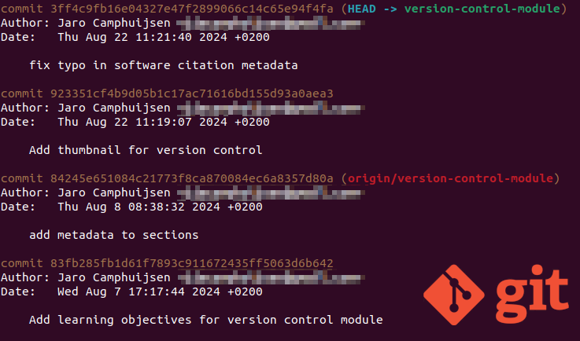
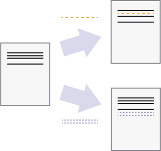
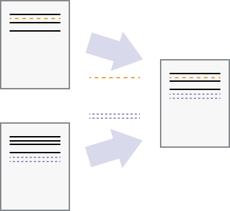
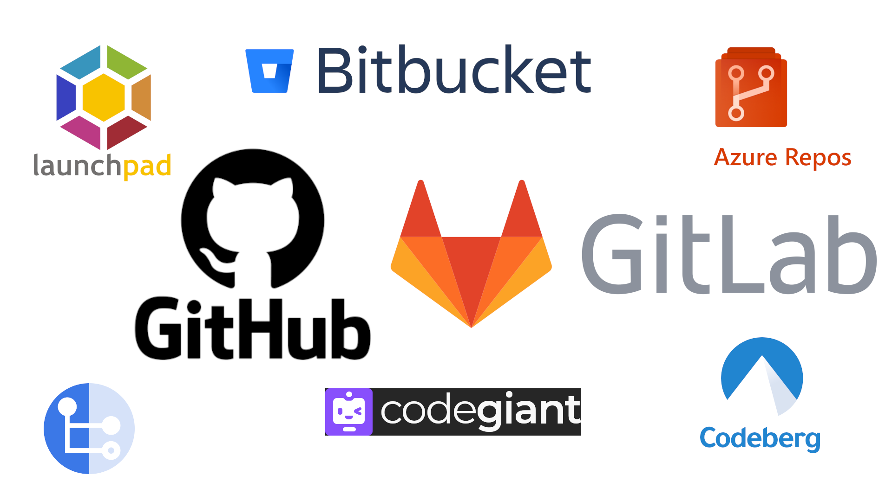

<!-- .slide: data-state="title"  -->

# Version Control

What is version control and why should I use it?

note:
You are probably using version control every day. Word documents store a history of changes for you, which you can undo. 

===

<!-- .slide: data-state="standard" -->

<small> "Piled Higher and Deeper” by Jorge Cham, http://www.phdcomics.com </small>

===

<!-- .slide: data-state="standard"  -->
## Documents are...

  a series of changes
  

note:
In version control systems, documents start with a base version and record all the changes that happened on top of that base version. Because of this you can always "play back" to an earlier version, while it does not store duplicates.

===

<!-- .slide: data-state="standard" -->

## Changes are stored

note:
A version control system (like git) keeps track of the individual changes for us, along with some useful metadata. A set of changes, along with its metadata in git is called a "commit". 

===

<!-- .slide: data-state="standard" -->
## More than one...

  independent changes
  

  can be merged
  

note:
When collaborating you might have various versions (sets of changes) that co-exist at the same time on so called "branches".

As long as the changes are not made to the same section (line of text) in a document (**conflict!**), the various changes can be merged together. 

===

<!-- .slide: data-state="standard" -->

## The right tool?

note:
Many different tools exist specifically for collaborative version control of computer source code and other simple text-based documents. It is often good to know what is the default or most-used tool in your university, institute or group. 

Git (for version control) with Gitlab and Github (for collaboration) are the mainstream, used by many and with lots of features. You might run into projects using other repositories.

===

<!-- .slide: data-state="standard" -->
## Key Points
- Version control is "track changes" on steroids, an unlimited **undo**.
- Version control also allows many people to work in parallel.
- 

===

<!-- .slide: data-state="standard" -->
## The Holy Realms of Git

<ul>
  <li><b>workspace</b>&nbsp;&nbsp;📂</li>
  <ul>
    <li>Your filesystem</li>
  </ul>
  <li class="fragment"><b>index</b>&nbsp;&nbsp;🕒
    <ul>
      <li>Staging area</li>
      <li>Files wait patiently to be committed</li>
    </ul>
  </li>
  <li class="fragment"><b>local repository</b>&nbsp;&nbsp;🗂️
    <ul>
      <li>Contains branches, commits, history, etc.</li>
    </ul>
  </li>
<ul>

===

<!-- .slide: data-state="standard" -->
## Crowded Staging Area / Index

The Staging Area / Index can hold many files and folders.

===

<!-- .slide: data-state="standard" data-background="media/footprint-g55586a507_1920.jpg" -->
## Tracking Changes: Key Points

- Files can be stored in
  - **working directory**: the files you can see
  - **staging area / index**: files about to be committed
  - **local repository**: the permanent record
- **git status**&nbsp; shows the status of a repository
- **git add**&nbsp; puts files in the staging area
- **git commit**&nbsp; saves the staged content as a new commit in the local repository
- Write short, descriptive, and imperative commit messages
